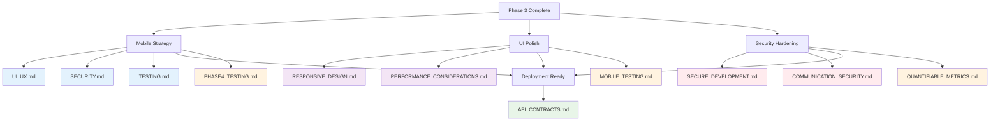

# Phase 4: Polish & Production - Document Map

> **Version**: 1.1.0  
> **Last Updated**: 2025-05-23

## AI Context Management

### 📋 Document Processing Groups
**Process these documents in separate AI sessions to maintain context:**

#### Session 4A: Mobile Strategy
- `docs/mobile/UI_UX.md`
- `docs/mobile/SECURITY.md`
- `docs/mobile/TESTING.md`

#### Session 4B: Security Hardening
- `docs/security/SECURE_DEVELOPMENT.md`
- `docs/security/COMMUNICATION_SECURITY.md`
- `docs/implementation/testing/PHASE4_TESTING.md`

#### Session 4C: UI Polish & Documentation
- `docs/ui/RESPONSIVE_DESIGN.md`
- `docs/ui/responsive/PERFORMANCE_CONSIDERATIONS.md`
- `docs/integration/API_CONTRACTS.md`

**⚠️ AI Implementation Rule**: Maximum 3-4 documents per session. Must complete Phase 3 validation checkpoint before starting Phase 4.

## Overview

This map consolidates all documentation references needed for Phase 4 implementation.

## Document Count: 11 Total
- Mobile Strategy: 3 documents
- UI Polish: 2 documents
- Security Hardening: 2 documents
- Documentation & Deployment: 1 document
- Testing Integration: 3 documents

## Visual Relationship Diagram



## Essential Documents for Phase 4

### 1. Mobile Strategy
- **[../../mobile/UI_UX.md](../../mobile/UI_UX.md)**: Mobile UI/UX
- **[../../mobile/SECURITY.md](../../mobile/SECURITY.md)**: Mobile security
- **[../../mobile/TESTING.md](../../mobile/TESTING.md)**: Mobile testing

### 2. UI Polish
- **[../../ui/RESPONSIVE_DESIGN.md](../../ui/RESPONSIVE_DESIGN.md)**: Responsive design
- **[../../ui/responsive/PERFORMANCE_CONSIDERATIONS.md](../../ui/responsive/PERFORMANCE_CONSIDERATIONS.md)**: Performance considerations

### 3. Security Hardening
- **[../../security/SECURE_DEVELOPMENT.md](../../security/SECURE_DEVELOPMENT.md)**: Secure development
- **[../../security/COMMUNICATION_SECURITY.md](../../security/COMMUNICATION_SECURITY.md)**: Communication security

### 4. Documentation & Deployment
- **[../../integration/API_CONTRACTS.md](../../integration/API_CONTRACTS.md)**: API documentation

### 5. Testing Integration
- **[../testing/PHASE4_TESTING.md](../testing/PHASE4_TESTING.md)**: Phase 4 testing integration
- **[../../mobile/TESTING.md](../../mobile/TESTING.md)**: Mobile testing strategy
- **[../testing/QUANTIFIABLE_METRICS.md](../testing/QUANTIFIABLE_METRICS.md)**: Validation metrics

## Implementation Sequence

```
Week 13-14: Mobile + UI Polish
├── UI_UX.md → MOBILE_STRATEGY.md
├── SECURITY.md → MOBILE_STRATEGY.md
├── TESTING.md → MOBILE_STRATEGY.md
├── RESPONSIVE_DESIGN.md → UI_POLISH.md
├── PERFORMANCE_CONSIDERATIONS.md → UI_POLISH.md
└── PHASE4_TESTING.md → Mobile Testing

Week 15: Security Hardening
├── SECURE_DEVELOPMENT.md → SECURITY_HARDENING.md
├── COMMUNICATION_SECURITY.md → SECURITY_HARDENING.md
└── Mobile Testing Validation

Week 16: Documentation + Launch
├── API_CONTRACTS.md → DOCUMENTATION.md
└── QUANTIFIABLE_METRICS.md → Launch Validation
```

## Success Criteria
✅ All 11 documents referenced and implemented correctly  
✅ Mobile-first responsive design implemented  
✅ Security hardened for production  
✅ Complete documentation suite  
✅ Launch preparation complete  
✅ All phase 4 validation metrics met  

## Version History
- **1.1.0**: Added testing integration documents and visual relationship diagram (2025-05-23)
- **1.0.0**: Created from MASTER_DOCUMENT_MAP.md refactoring (2025-05-23)
