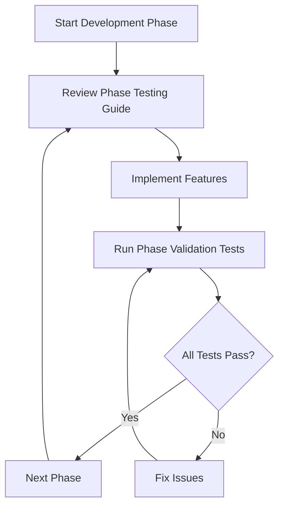

# Testing Integration Overview

> **Version**: 1.0.0  
> **Last Updated**: 2025-05-23

## Testing Documentation Structure

The testing integration is organized into focused, phase-based guides for better AI processing and maintainability.

### Phase-Based Testing Guides
- **[PHASE1_TESTING.md](PHASE1_TESTING.md)**: Foundation testing (Database, Auth, RBAC, Multi-Tenant)
- **[PHASE2_TESTING.md](PHASE2_TESTING.md)**: Core features testing (Advanced RBAC, Enhanced features)
- **[PHASE3_TESTING.md](PHASE3_TESTING.md)**: Advanced features testing (Dashboards, Security Monitoring)
- **[PHASE4_TESTING.md](PHASE4_TESTING.md)**: Production testing (Mobile, Security Hardening)

### Testing Implementation Flow

### Core Testing Principles

1. **Phase-Based Validation**: Each phase has specific testing requirements
2. **Performance Integration**: Testing includes performance validation at each stage
3. **Regression Prevention**: New features must not break existing functionality
4. **Mobile-First Validation**: All testing includes mobile responsiveness from Phase 1

### Performance Standards Integration

All testing phases integrate with [../../PERFORMANCE_STANDARDS.md](../../PERFORMANCE_STANDARDS.md) for:
- Phase-based performance targets
- Regression prevention
- Real-time monitoring validation
- Mobile-first performance requirements

## Quick Start Guide

1. **Identify Current Phase**: Determine which development phase you're in
2. **Review Phase Testing Guide**: Read the corresponding PHASE_X_TESTING.md
3. **Implement Required Tests**: Follow the phase-specific testing requirements
4. **Validate Performance**: Ensure performance targets are met
5. **Run Regression Tests**: Verify no existing functionality is broken

## Success Criteria by Phase

- **Phase 1**: Foundation stability, basic performance targets met
- **Phase 2**: Enhanced features operational, cache optimization achieved
- **Phase 3**: Advanced features functional, dashboard performance optimized
- **Phase 4**: Production readiness, mobile optimization complete

## Related Documentation

- [../../TEST_FRAMEWORK.md](../../TEST_FRAMEWORK.md): Overall testing architecture
- [../../testing/SECURITY_TESTING.md](../../testing/SECURITY_TESTING.md): Security testing strategy
- [../../testing/PERFORMANCE_TESTING.md](../../testing/PERFORMANCE_TESTING.md): Performance testing approach
- [../../rbac/TESTING_STRATEGY.md](../../rbac/TESTING_STRATEGY.md): RBAC-specific testing

## Version History

- **1.0.0**: Created focused testing overview from TESTING_INTEGRATION_GUIDE.md (2025-05-23)
