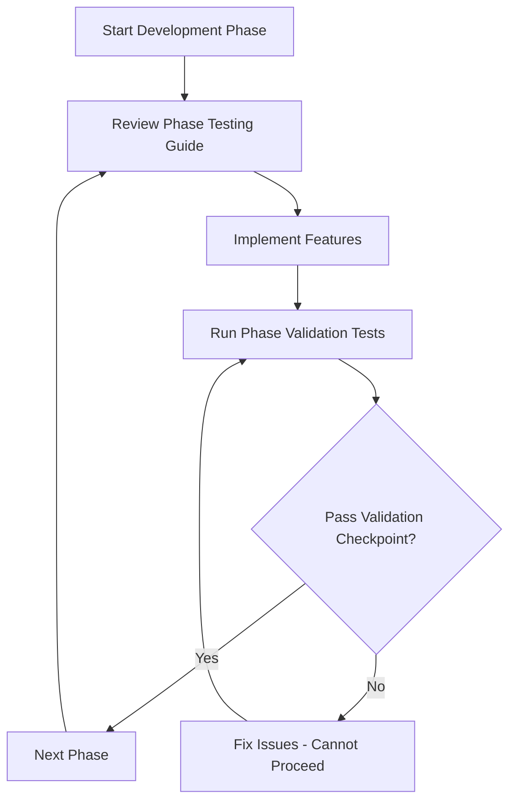

# Testing Integration Overview

> **Version**: 1.1.0  
> **Last Updated**: 2025-05-23

## Testing Documentation Structure

The testing integration is organized into focused, phase-based guides with mandatory validation checkpoints for better AI processing and maintainability.

### Phase-Based Testing Guides
- **[PHASE1_TESTING.md](PHASE1_TESTING.md)**: Foundation testing (Database, Auth, RBAC, Multi-Tenant)
- **[PHASE2_TESTING.md](PHASE2_TESTING.md)**: Core features testing (Advanced RBAC, Enhanced features)
- **[PHASE3_TESTING.md](PHASE3_TESTING.md)**: Advanced features testing (Dashboards, Security Monitoring)
- **[PHASE4_TESTING.md](PHASE4_TESTING.md)**: Production testing (Mobile, Security Hardening)

### Validation Checkpoints
- **[../PHASE_VALIDATION_CHECKPOINTS.md](../PHASE_VALIDATION_CHECKPOINTS.md)**: Mandatory validation gates between phases

### Testing Implementation Flow

### Core Testing Principles

1. **Phase-Based Validation**: Each phase has specific testing requirements
2. **Mandatory Checkpoints**: Cannot proceed without passing validation gates
3. **Performance Integration**: Testing includes performance validation at each stage
4. **Regression Prevention**: New features must not break existing functionality
5. **Mobile-First Validation**: All testing includes mobile responsiveness from Phase 1

### Validation Gate Requirements

Each validation checkpoint requires:
- **100% automated test pass rate**
- **Performance targets met or exceeded**
- **Security review completed with no critical issues**
- **Documentation updated and accurate**
- **No regressions from previous phases**

### Performance Standards Integration

All testing phases integrate with [../../PERFORMANCE_STANDARDS.md](../../PERFORMANCE_STANDARDS.md) for:
- Phase-based performance targets
- Regression prevention
- Real-time monitoring validation
- Mobile-first performance requirements

## Quick Start Guide

1. **Identify Current Phase**: Determine which development phase you're in
2. **Review Phase Testing Guide**: Read the corresponding PHASE_X_TESTING.md
3. **Implement Required Tests**: Follow the phase-specific testing requirements
4. **Validate Performance**: Ensure performance targets are met
5. **Run Validation Checkpoint**: Execute mandatory validation gate tests
6. **Verify Checkpoint Pass**: Ensure all validation criteria are met before proceeding

## Success Criteria by Phase

- **Phase 1**: Foundation stability, basic performance targets met, validation checkpoint passed
- **Phase 2**: Enhanced features operational, cache optimization achieved, validation checkpoint passed
- **Phase 3**: Advanced features functional, dashboard performance optimized, validation checkpoint passed
- **Phase 4**: Production readiness, mobile optimization complete, validation checkpoint passed

## Blocking Conditions

**Cannot proceed to next phase if:**
- Any validation checkpoint test fails
- Performance targets not met
- Security vulnerabilities identified
- Documentation incomplete or inaccurate
- Previous phase functionality regressed

## Related Documentation

- [../../TEST_FRAMEWORK.md](../../TEST_FRAMEWORK.md): Overall testing architecture
- [../../testing/SECURITY_TESTING.md](../../testing/SECURITY_TESTING.md): Security testing strategy
- [../../testing/PERFORMANCE_TESTING.md](../../testing/PERFORMANCE_TESTING.md): Performance testing approach
- [../../rbac/TESTING_STRATEGY.md](../../rbac/TESTING_STRATEGY.md): RBAC-specific testing
- [../PHASE_VALIDATION_CHECKPOINTS.md](../PHASE_VALIDATION_CHECKPOINTS.md): Complete validation requirements

## Version History

- **1.1.0**: Added mandatory validation checkpoint integration and blocking conditions (2025-05-23)
- **1.0.0**: Created focused testing overview from TESTING_INTEGRATION_GUIDE.md (2025-05-23)
