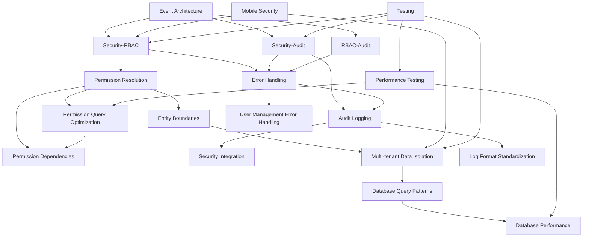

# Integration Documentation Map

> **Version**: 1.3.0  
> **Last Updated**: 2025-05-22

This document provides a navigational map for all integration documentation, showing the relationships between different integration components and their primary documentation sources.

## Core Integration Documents

- **[OVERVIEW.md](OVERVIEW.md)**: High-level overview of system integrations
- **[EVENT_ARCHITECTURE.md](EVENT_ARCHITECTURE.md)**: Canonical event architecture
- **[API_CONTRACTS.md](API_CONTRACTS.md)**: API contracts between components
- **[TECHNICAL_DEPENDENCIES.md](TECHNICAL_DEPENDENCIES.md)**: Technical dependencies between components

## Security Integrations

- **[SECURITY_RBAC_INTEGRATION.md](SECURITY_RBAC_INTEGRATION.md)**: Security and RBAC integration
- **[SECURITY_AUDIT_INTEGRATION.md](SECURITY_AUDIT_INTEGRATION.md)**: Security and Audit integration
- **[SESSION_AUTH_INTEGRATION.md](SESSION_AUTH_INTEGRATION.md)**: Session and Authentication integration
- **[../security/ERROR_HANDLING.md](../security/ERROR_HANDLING.md)**: Standardized error handling across integrations
- **[../security/THREAT_MODELING.md](../security/THREAT_MODELING.md)**: Security threat modeling approach

## RBAC Integrations

- **[RBAC_AUDIT_INTEGRATION.md](RBAC_AUDIT_INTEGRATION.md)**: RBAC and Audit integration
- **[../rbac/PERMISSION_RESOLUTION.md](../rbac/PERMISSION_RESOLUTION.md)**: Permission resolution process
- **[../rbac/PERMISSION_QUERY_OPTIMIZATION.md](../rbac/PERMISSION_QUERY_OPTIMIZATION.md)**: Permission query optimization
- **[../rbac/PERMISSION_DEPENDENCIES.md](../rbac/PERMISSION_DEPENDENCIES.md)**: Functional dependencies between permission types
- **[../rbac/diagrams/PERMISSION_RESOLUTION_FLOW.md](../rbac/diagrams/PERMISSION_RESOLUTION_FLOW.md)**: Visual diagram of permission resolution

## Audit Integrations

- **[../audit/LOGGING_SERVICE.md](../audit/LOGGING_SERVICE.md)**: Audit logging service
- **[../audit/SECURITY_INTEGRATION.md](../audit/SECURITY_INTEGRATION.md)**: Audit system's security integration
- **[../audit/LOG_FORMAT_STANDARDIZATION.md](../audit/LOG_FORMAT_STANDARDIZATION.md)**: Standardized log format across subsystems

## Multi-Tenant Integrations

- **[../multitenancy/DATA_ISOLATION.md](../multitenancy/DATA_ISOLATION.md)**: Multi-tenant data isolation
- **[../multitenancy/SESSION_MANAGEMENT.md](../multitenancy/SESSION_MANAGEMENT.md)**: Multi-tenant session management
- **[../multitenancy/DATABASE_QUERY_PATTERNS.md](../multitenancy/DATABASE_QUERY_PATTERNS.md)**: Multi-tenant database query patterns
- **[../multitenancy/DATABASE_PERFORMANCE.md](../multitenancy/DATABASE_PERFORMANCE.md)**: Multi-tenant database performance

## Error Handling Integration

- **[../security/ERROR_HANDLING.md](../security/ERROR_HANDLING.md)**: Error handling standards
- **[SECURITY_AUDIT_INTEGRATION.md](SECURITY_AUDIT_INTEGRATION.md)**: Error logging integration with audit system
- **[SECURITY_RBAC_INTEGRATION.md](SECURITY_RBAC_INTEGRATION.md)**: Error handling in permission checks
- **[../user-management/ERROR_HANDLING.md](../user-management/ERROR_HANDLING.md)**: User management error handling

## Testing Integration

- **[../testing/SECURITY_TESTING.md](../testing/SECURITY_TESTING.md)**: Security testing strategy
- **[../testing/PERFORMANCE_TESTING.md](../testing/PERFORMANCE_TESTING.md)**: Performance testing strategy
- **[../testing/MULTI_TENANT_TESTING.md](../testing/MULTI_TENANT_TESTING.md)**: Multi-tenant testing approach

## Mobile Integration

- **[../mobile/SECURITY.md](../mobile/SECURITY.md)**: Mobile security implementation
- **[../mobile/INTEGRATION.md](../mobile/INTEGRATION.md)**: Mobile integration with core platform

## Integration Visualization

## Version History

- **1.3.0**: Added references to new testing documents, user management error handling, and mobile integration (2025-05-22)
- **1.2.0**: Added explicit error handling integration section and connections to log format standardization (2025-05-22)
- **1.1.0**: Added references to ERROR_HANDLING.md, PERMISSION_DEPENDENCIES.md, and DATABASE_QUERY_PATTERNS.md (2025-05-22)
- **1.0.0**: Initial documentation map
