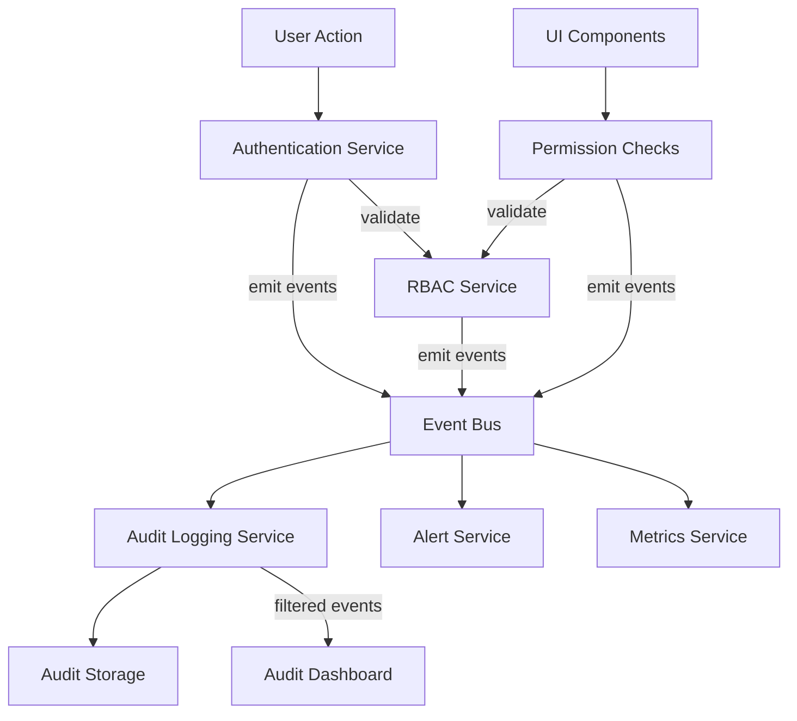

# Event-Driven Architecture

> **Version**: 1.2.0  
> **Last Updated**: 2025-05-22

## Overview

This document defines the canonical event architecture that must be implemented consistently across all subsystems. The event architecture provides a loosely coupled integration mechanism with guaranteed delivery and scalable processing.

## Event Flow Architecture

The integration between systems follows this standardized event-driven architecture pattern:



## Event Bus Configuration

The Event Bus must be configured consistently across all subsystems:
- Support multiple consumers for each event
- Guarantee event delivery (at-least-once semantics)
- Maintain event order within each category
- Support filtering and routing based on event properties
- Provide retry mechanisms for failed deliveries

```typescript
// Standard event bus configuration to be used by all subsystems
const eventBusConfig = {
  channels: {
    'security': {
      bufferSize: 1000,
      consumers: ['audit-logger', 'metrics-service', 'alert-service'],
      retryStrategy: {
        attempts: 3,
        backoff: 'exponential',
        initialDelay: 100, // ms
        maxDelay: 5000 // ms
      }
    },
    'rbac': {
      bufferSize: 500,
      consumers: ['audit-logger', 'permission-cache-invalidator'],
      retryStrategy: {
        attempts: 2,
        backoff: 'fixed',
        delay: 200 // ms
      }
    },
    'audit': {
      bufferSize: 2000,
      consumers: ['audit-storage-service', 'audit-dashboard-realtime'],
      retryStrategy: {
        attempts: 5,
        backoff: 'exponential',
        initialDelay: 100, // ms
        maxDelay: 10000 // ms
      }
    }
  },
  defaultConsumer: 'audit-logger'
};
```

## Canonical Event Types

The system defines these primary event categories that all subsystems must adhere to:

1. **Security Events**
   - Authentication events (login, logout, etc.)
   - Security configuration changes
   - Security policy enforcement events
   
2. **RBAC Events**
   - Permission check events
   - Role assignment events
   - Permission configuration changes
   
3. **Audit Events**
   - System audit events
   - User activity events
   - Compliance-related events
   
4. **System Events**
   - Application lifecycle events
   - Error and exception events
   - Performance monitoring events

## Standard Event Production and Consumption

### Event Production Interface

All subsystems must produce events through this standardized event emitter interface:

```typescript
interface EventEmitter {
  /**
   * Emit an event on a specific channel
   */
  emit<T extends BaseEvent>(channel: string, event: T): Promise<void>;
  
  /**
   * Emit an event with delivery guarantees
   */
  emitWithGuarantee<T extends BaseEvent>(
    channel: string, 
    event: T, 
    options?: {
      priority?: 'high' | 'normal' | 'low';
      idempotencyKey?: string;
      deliveryDeadline?: Date;
    }
  ): Promise<void>;
}
```

### Event Consumption Interface

All subsystems must consume events through this standardized event consumer interface:

```typescript
interface EventConsumer {
  /**
   * Subscribe to events on a specific channel
   */
  subscribe<T extends BaseEvent>(
    channel: string, 
    handler: (event: T) => Promise<void>,
    options?: {
      filter?: (event: T) => boolean;
      batchSize?: number;
      maxConcurrency?: number;
    }
  ): Subscription;
  
  /**
   * Unsubscribe from events
   */
  unsubscribe(subscription: Subscription): void;
}
```

## Canonical Event Schema

All events across all subsystems MUST follow this standardized schema:

```typescript
interface BaseEvent {
  id: string;                // Unique event identifier
  type: string;              // Event type identifier
  source: string;            // System component that generated the event
  time: string;              // ISO timestamp when the event occurred
  dataVersion: string;       // Schema version for the data payload
  correlationId?: string;    // Request correlation ID for tracing
}

interface DomainEvent<T> extends BaseEvent {
  data: T;                   // Event-specific data payload
  metadata?: {               // Optional metadata
    user?: string;           // User associated with the event
    ip?: string;             // Originating IP address
    userAgent?: string;      // Originating user agent
    entityId?: string;       // Entity context for multi-tenant events
    tenantId?: string;       // Tenant identifier for multi-tenant systems
    [key: string]: any;      // Additional metadata
  };
}
```

## Resilience Patterns

All subsystems using the event architecture must implement these resilience patterns:

1. **Retry Mechanism**
   - Failed event deliveries are retried based on configured strategy
   - Retry count and timing is configurable per channel
   - Dead letter queues capture repeatedly failed deliveries
   
2. **Circuit Breakers**
   - Failing consumers are isolated to prevent cascade failures
   - Automatic recovery attempts after cooling period
   - Health metrics influence circuit state
   
3. **Back Pressure Handling**
   - Buffer limits prevent memory exhaustion
   - Slow consumers trigger adaptive throttling
   - Priority queuing ensures critical events are processed first

## Event Bus Implementation

All subsystems must use this canonical event bus implementation:

```typescript
class EventBusService implements EventEmitter, EventConsumer {
  private channels: Map<string, Channel>;
  private config: EventBusConfig;
  
  constructor(config: EventBusConfig) {
    this.config = config;
    this.channels = new Map();
    
    // Initialize channels from config
    Object.entries(config.channels).forEach(([name, channelConfig]) => {
      this.channels.set(name, new Channel(name, channelConfig));
    });
  }
  
  async emit<T extends BaseEvent>(channel: string, event: T): Promise<void> {
    const targetChannel = this.getOrCreateChannel(channel);
    await targetChannel.publish(event);
  }
  
  async emitWithGuarantee<T extends BaseEvent>(
    channel: string, 
    event: T, 
    options?: EmitOptions
  ): Promise<void> {
    const targetChannel = this.getOrCreateChannel(channel);
    await targetChannel.publishWithGuarantee(event, options);
  }
  
  subscribe<T extends BaseEvent>(
    channel: string,
    handler: (event: T) => Promise<void>,
    options?: SubscribeOptions
  ): Subscription {
    const targetChannel = this.getOrCreateChannel(channel);
    return targetChannel.subscribe(handler, options);
  }
  
  unsubscribe(subscription: Subscription): void {
    const channel = this.channels.get(subscription.channel);
    if (channel) {
      channel.unsubscribe(subscription);
    }
  }
  
  private getOrCreateChannel(name: string): Channel {
    if (!this.channels.has(name)) {
      const config = this.config.channels[name] || 
                    { bufferSize: 100, consumers: [] };
      this.channels.set(name, new Channel(name, config));
    }
    return this.channels.get(name)!;
  }
}
```

## Multi-Tenant Event Considerations

### Tenant Context in Events

All events in a multi-tenant system must follow these additional requirements:

1. **Tenant Context Preservation**:
   - All events must include tenant context in metadata
   - Event processing must maintain tenant isolation
   - Cross-tenant events must be explicitly marked

2. **Tenant-Specific Event Filtering**:
   - Event consumers can filter by tenant
   - Tenant-specific subscriptions are supported
   - Processing priority can be tenant-aware

3. **Event Schema for Multi-Tenant Events**:

```typescript
interface MultiTenantEvent<T> extends DomainEvent<T> {
  metadata: {
    tenantId: string;           // Required for multi-tenant events
    crossTenant?: boolean;      // Flag for cross-tenant operations
    sourceTenantId?: string;    // For cross-tenant events
    targetTenantId?: string;    // For cross-tenant events
    user?: string;
    ip?: string;
    userAgent?: string;
    [key: string]: any;
  };
}

// Example event producer with tenant awareness
class TenantAwareEventProducer {
  private eventBus: EventEmitter;
  private tenantContextService: TenantContextService;
  
  constructor(eventBus: EventEmitter, tenantContextService: TenantContextService) {
    this.eventBus = eventBus;
    this.tenantContextService = tenantContextService;
  }
  
  async emitEvent<T>(channel: string, eventType: string, data: T): Promise<void> {
    const tenantId = this.tenantContextService.getCurrentTenantId();
    if (!tenantId) {
      throw new Error('No tenant context available');
    }
    
    await this.eventBus.emit(channel, {
      id: generateUuid(),
      type: eventType,
      source: 'tenant-aware-producer',
      time: new Date().toISOString(),
      dataVersion: '1.0',
      data,
      metadata: {
        tenantId,
        user: getCurrentUserId()
      }
    });
  }
  
  async emitCrossTenantEvent<T>(
    channel: string, 
    eventType: string, 
    data: T,
    sourceTenantId: string,
    targetTenantId: string
  ): Promise<void> {
    // Verify user has cross-tenant permission
    if (!await this.hasPermission('CrossTenantOperations')) {
      throw new Error('Permission denied for cross-tenant operation');
    }
    
    await this.eventBus.emit(channel, {
      id: generateUuid(),
      type: eventType,
      source: 'tenant-aware-producer',
      time: new Date().toISOString(),
      dataVersion: '1.0',
      data,
      metadata: {
        crossTenant: true,
        sourceTenantId,
        targetTenantId,
        user: getCurrentUserId()
      }
    });
  }
  
  private async hasPermission(permission: string): Promise<boolean> {
    // Implementation according to RBAC_SYSTEM.md
    return true; // Placeholder
  }
}
```

## Subsystem-Specific Event Guidelines

### Security Event Integration

For detailed event integration with the Security system:
- All security events must follow the canonical event schema
- See [SECURITY_AUDIT_INTEGRATION.md](SECURITY_AUDIT_INTEGRATION.md) for specific event types
- Authentication events must include user context and device information

### RBAC Event Integration

For detailed event integration with the RBAC system:
- All RBAC events must follow the canonical event schema
- See [SECURITY_RBAC_INTEGRATION.md](SECURITY_RBAC_INTEGRATION.md) for permission event specifications
- Entity context must be included in all relevant events

### Audit Event Integration

For detailed event integration with the Audit logging system:
- All audit events must follow the canonical event schema
- See [RBAC_AUDIT_INTEGRATION.md](RBAC_AUDIT_INTEGRATION.md) for audit trail requirements
- Entity boundary validation must follow [../rbac/ENTITY_BOUNDARIES.md](../rbac/ENTITY_BOUNDARIES.md)

### Multi-Tenant Event Integration

For detailed event integration with the Multi-Tenant architecture:
- All multi-tenant events must include tenant context
- See [../multitenancy/DATA_ISOLATION.md](../multitenancy/DATA_ISOLATION.md) for data isolation strategies
- Cross-tenant operations must be explicitly authorized

## Related Documentation

- **[SECURITY_RBAC_INTEGRATION.md](SECURITY_RBAC_INTEGRATION.md)**: Security and RBAC integration
- **[RBAC_AUDIT_INTEGRATION.md](RBAC_AUDIT_INTEGRATION.md)**: RBAC and Audit integration
- **[SECURITY_AUDIT_INTEGRATION.md](SECURITY_AUDIT_INTEGRATION.md)**: Security and Audit integration
- **[API_CONTRACTS.md](API_CONTRACTS.md)**: API contracts between components
- **[../audit/SECURITY_INTEGRATION.md](../audit/SECURITY_INTEGRATION.md)**: Audit system integration with security implementation
- **[../rbac/ENTITY_BOUNDARIES.md](../rbac/ENTITY_BOUNDARIES.md)**: Canonical entity boundary implementation
- **[../multitenancy/DATA_ISOLATION.md](../multitenancy/DATA_ISOLATION.md)**: Multi-tenant data isolation strategies

## Version History

- **1.2.0**: Added comprehensive multi-tenant event considerations section (2025-05-22)
- **1.1.0**: Established as canonical reference for event architecture across all subsystems (2025-05-22)
- **1.0.0**: Initial event architecture specification
