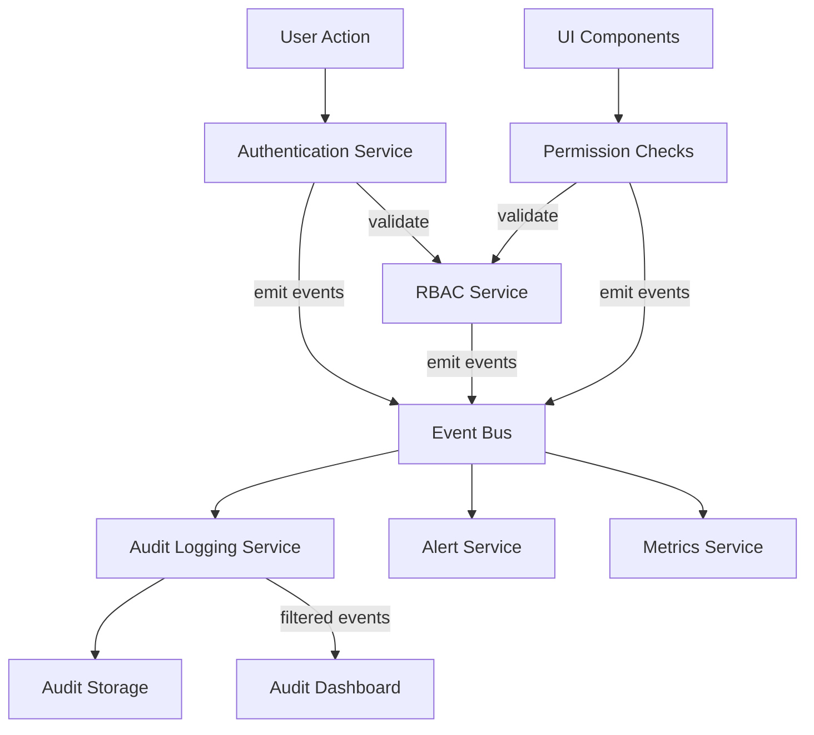

# Integration Architecture Overview

> **Version**: 1.1.0  
> **Last Updated**: 2025-05-24

## Overview

This document provides a high-level overview of the integration architecture that enables communication and data flow between core system components, specifically focusing on Security, RBAC, and Audit Logging subsystems.

## System Component Interactions

The system's core components interact through well-defined integration points:

## Primary Integration Patterns

The integration architecture employs these key patterns:

1. **Event-Driven Architecture**
   - Events published to central event bus
   - Multiple consumers for different event types
   - Guaranteed delivery with at-least-once semantics
   - Event ordering preserved within categories

2. **API Contracts**
   - Well-defined interfaces between components
   - Standardized request/response structures
   - Versioned interfaces for backward compatibility
   - Comprehensive error handling patterns

3. **Context Propagation**
   - User context shared across components
   - Request context maintained throughout processing
   - Security information passed between subsystems

4. **Shared Configuration**
   - Centralized configuration for cross-cutting concerns
   - Feature flags accessible to all components
   - Environment-specific settings management

## Key Integration Points

The major integration points between subsystems are:

1. **Security ↔ RBAC Integration**
   - Authentication results feed into permission resolution
   - User roles and permissions included in security context
   - Session management coordinated between systems
   - See details in [SECURITY_RBAC_INTEGRATION.md](src/docs/integration/SECURITY_RBAC_INTEGRATION.md)

2. **RBAC ↔ Audit Integration**
   - Permission changes logged to audit system
   - Access attempts recorded with context
   - Administrative actions tracked for compliance
   - See details in [RBAC_AUDIT_INTEGRATION.md](src/docs/integration/RBAC_AUDIT_INTEGRATION.md)

3. **Security ↔ Audit Integration**
   - Authentication events recorded
   - Security configuration changes logged
   - Security policy enforcement monitored
   - See details in [SECURITY_AUDIT_INTEGRATION.md](src/docs/integration/SECURITY_AUDIT_INTEGRATION.md)

4. **Session ↔ Authentication Integration**
   - Session state synchronized with authentication
   - Multi-tenant session context maintained
   - Session security enforcement
   - See details in [SESSION_AUTH_INTEGRATION.md](src/docs/integration/SESSION_AUTH_INTEGRATION.md)

## Explicit Integration Requirements

### Cross-System Data Flow
- **Authentication Context**: User identity flows from auth to RBAC to audit
- **Permission Context**: Permission results affect UI rendering and API access
- **Tenant Context**: Tenant boundaries enforced across all system interactions
- **Audit Context**: All system actions generate standardized audit events

### Integration Validation Points
- **Authentication Propagation**: User context reaches all dependent systems
- **Permission Enforcement**: RBAC decisions respected by all components
- **Audit Coverage**: All significant actions generate audit events
- **Tenant Isolation**: Cross-tenant data leakage prevented

## Implementation Approach

The integration architecture follows these implementation guidelines:

1. **Loose Coupling**
   - Components communicate through well-defined interfaces
   - Implementation details encapsulated
   - Changes in one component minimize impact on others

2. **High Cohesion**
   - Related functionality grouped together
   - Clear separation of concerns
   - Focused component responsibilities

3. **Resilience Patterns**
   - Graceful degradation when dependencies unavailable
   - Circuit breakers for failing dependencies
   - Retry strategies for transient failures

4. **Performance Considerations**
   - Asynchronous processing for non-critical paths
   - Caching for frequently accessed data
   - Batch operations for higher throughput

## Related Documentation

For detailed implementation specifications of each integration point, please refer to:

- **[SECURITY_RBAC_INTEGRATION.md](src/docs/integration/SECURITY_RBAC_INTEGRATION.md)**: Security and RBAC integration
- **[RBAC_AUDIT_INTEGRATION.md](src/docs/integration/RBAC_AUDIT_INTEGRATION.md)**: RBAC and Audit integration
- **[SECURITY_AUDIT_INTEGRATION.md](src/docs/integration/SECURITY_AUDIT_INTEGRATION.md)**: Security and Audit integration
- **[SESSION_AUTH_INTEGRATION.md](src/docs/integration/SESSION_AUTH_INTEGRATION.md)**: Session and Authentication integration
- **[EVENT_ARCHITECTURE.md](src/docs/integration/EVENT_ARCHITECTURE.md)**: Event architecture details
- **[API_CONTRACTS.md](src/docs/integration/API_CONTRACTS.md)**: API contract specifications
- **[TECHNICAL_DEPENDENCIES.md](src/docs/integration/TECHNICAL_DEPENDENCIES.md)**: Shared dependencies

## Version History

- **1.1.0**: Fixed cross-reference consistency and added explicit integration requirements (2025-05-24)
- **1.0.0**: Initial integration architecture overview
