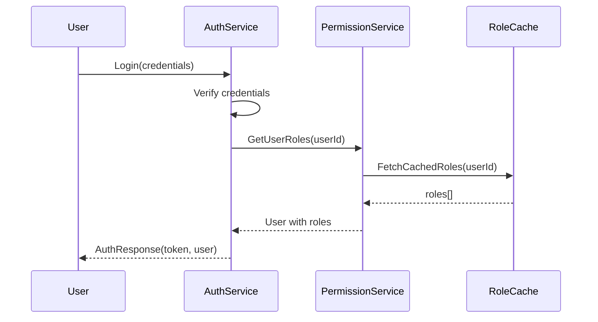

# Security and RBAC Integration

> **Version**: 1.2.0  
> **Last Updated**: 2025-05-23

## Overview

This document details the integration between the Security system and the Role-Based Access Control (RBAC) system, defining how authentication flows integrate with the direct permission assignment model.

## Authentication to Permission Resolution Flow



## Direct Permission Assignment Integration

### Permission Check Interface

```typescript
interface DirectPermissionInterface {
  /**
   * Check if a user has a specific permission using direct assignment model
   */
  checkDirectPermission(
    userId: string, 
    resource: string, 
    action: string, 
    resourceId?: string,
    context?: Record<string, any>
  ): Promise<boolean>;
  
  /**
   * Check multiple permissions at once using union approach
   */
  checkMultipleDirectPermissions(
    userId: string,
    checks: Array<{
      resource: string;
      action: string;
      resourceId?: string;
      context?: Record<string, any>;
    }>
  ): Promise<Array<{
    resource: string;
    action: string;
    granted: boolean;
  }>>;
  
  /**
   * Get all permissions for a user (union of all role permissions)
   */
  getUserPermissionUnion(
    userId: string,
    tenantId?: string
  ): Promise<Array<{
    resource: string;
    action: string;
  }>>;
}
```

### Role Management Interface

```typescript
interface DirectRoleManagementInterface {
  /**
   * Get all roles directly assigned to a user
   */
  getUserDirectRoles(userId: string): Promise<Role[]>;
  
  /**
   * Assign a role directly to a user
   */
  assignDirectRoleToUser(
    userId: string, 
    roleId: string, 
    assignedBy: string
  ): Promise<void>;
  
  /**
   * Remove a role directly from a user
   */
  removeDirectRoleFromUser(
    userId: string, 
    roleId: string, 
    removedBy: string
  ): Promise<void>;
  
  /**
   * Check if a user has specific role (direct assignment only)
   */
  userHasDirectRole(userId: string, roleName: string): Promise<boolean>;
}
```

## Implementation Requirements

### Authentication Middleware

```typescript
// Authentication middleware with direct permission model
function authenticate(req: Request, res: Response, next: NextFunction) {
  const token = extractTokenFromRequest(req);
  
  if (!token) {
    return res.status(401).json({ error: 'Authentication required' });
  }
  
  try {
    const decoded = verifyToken(token);
    const userId = decoded.sub;
    
    // Get user roles using direct assignment model
    const roles = await permissionService.getUserDirectRoles(userId);
    
    // Store user and roles in request context
    req.user = {
      id: userId,
      roles,
      permissions: decoded.permissions || []
    };
    
    next();
  } catch (error) {
    return res.status(401).json({ error: 'Invalid authentication' });
  }
}
```

### Authorization Integration Points

Permission checks are performed using the direct assignment model at:
- API endpoints via middleware
- Route guards in frontend applications
- UI component rendering logic
- Service layer business logic
- Database queries through RLS policies

## Permission Check Request/Response

```typescript
interface DirectPermissionCheckRequest {
  userId: string;
  resource: string;
  action: string;
  resourceId?: string;
  context?: Record<string, any>;
}

interface DirectPermissionCheckResponse {
  granted: boolean;
  reason?: string;
  grantedBy?: {
    roleId: string;
    roleName: string;
  }[];
}
```

## Error Handling

The Security and RBAC integration implements standardized error handling:

1. **Authentication Errors**
   - All authentication failures follow standardized error format
   - Error responses never reveal whether a user exists
   - Multiple authentication failures trigger security events

2. **Permission Check Errors**
   - Permission denials are logged with appropriate context
   - Errors include traceId for correlation with audit logs
   - Performance optimizations for error cases

3. **Critical Integration Errors**
   - Service unavailability is handled gracefully
   - Fallback mechanisms for critical security functions
   - All integration errors are properly classified and logged

## Related Documentation

- **[../security/AUTH_SYSTEM.md](../security/AUTH_SYSTEM.md)**: Authentication system details
- **[../security/ERROR_HANDLING.md](../security/ERROR_HANDLING.md)**: Standardized error handling
- **[../rbac/PERMISSION_RESOLUTION.md](../rbac/PERMISSION_RESOLUTION.md)**: Direct permission resolution
- **[SECURITY_AUDIT_INTEGRATION.md](SECURITY_AUDIT_INTEGRATION.md)**: Security audit integration
- **[EVENT_ARCHITECTURE.md](EVENT_ARCHITECTURE.md)**: Event architecture for integration

## Version History

- **1.2.0**: Updated to align with direct permission assignment model (2025-05-23)
- **1.1.0**: Added explicit error handling section (2025-05-22)
- **1.0.0**: Initial Security and RBAC integration specification
