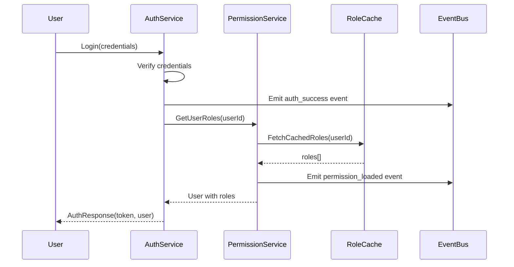

# Security and RBAC Integration

> **Version**: 2.0.0  
> **Last Updated**: 2025-05-23

## Overview

This document details the integration between the Security system and the Role-Based Access Control (RBAC) system, defining how authentication flows integrate with the direct permission assignment model.

## Canonical Event Architecture Reference

**IMPORTANT**: All security and RBAC event integration follows the patterns defined in [EVENT_ARCHITECTURE.md](EVENT_ARCHITECTURE.md). This document provides implementation details that extend the canonical event architecture.

## Authentication to Permission Resolution Flow



## Direct Permission Assignment Integration

### Permission Check Interface with Event Integration

```typescript
interface DirectPermissionInterface {
  /**
   * Check if a user has a specific permission using direct assignment model
   * Emits events using canonical event architecture
   */
  checkDirectPermission(
    userId: string, 
    resource: string, 
    action: string, 
    resourceId?: string,
    context?: Record<string, any>
  ): Promise<boolean>;
  
  /**
   * Check multiple permissions at once using union approach
   * Emits bulk permission check events
   */
  checkMultipleDirectPermissions(
    userId: string,
    checks: Array<{
      resource: string;
      action: string;
      resourceId?: string;
      context?: Record<string, any>;
    }>
  ): Promise<Array<{
    resource: string;
    action: string;
    granted: boolean;
  }>>;
  
  /**
   * Get all permissions for a user (union of all role permissions)
   * Emits permission enumeration events
   */
  getUserPermissionUnion(
    userId: string,
    tenantId?: string
  ): Promise<Array<{
    resource: string;
    action: string;
  }>>;
}
```

### Role Management Interface with Event Integration

```typescript
interface DirectRoleManagementInterface {
  /**
   * Get all roles directly assigned to a user
   * Emits role query events using canonical event architecture
   */
  getUserDirectRoles(userId: string): Promise<Role[]>;
  
  /**
   * Assign a role directly to a user
   * Emits role assignment events using canonical event architecture
   */
  assignDirectRoleToUser(
    userId: string, 
    roleId: string, 
    assignedBy: string
  ): Promise<void>;
  
  /**
   * Remove a role directly from a user
   * Emits role removal events using canonical event architecture
   */
  removeDirectRoleFromUser(
    userId: string, 
    roleId: string, 
    removedBy: string
  ): Promise<void>;
  
  /**
   * Check if a user has specific role (direct assignment only)
   * Emits role check events using canonical event architecture
   */
  userHasDirectRole(userId: string, roleName: string): Promise<boolean>;
}
```

## Implementation with Canonical Event Architecture

### Authentication Middleware with Event Integration

```typescript
// Authentication middleware with direct permission model and event integration
function authenticate(req: Request, res: Response, next: NextFunction) {
  const token = extractTokenFromRequest(req);
  
  if (!token) {
    // Emit authentication failure event using canonical architecture
    eventBus.emit('security', {
      id: generateUUID(),
      type: 'security.authentication',
      source: 'auth-middleware',
      time: new Date().toISOString(),
      dataVersion: '1.0',
      data: {
        result: 'failure',
        reason: 'missing_token'
      },
      metadata: {
        ip: req.ip,
        userAgent: req.get('User-Agent')
      }
    });
    
    return res.status(401).json({ error: 'Authentication required' });
  }
  
  try {
    const decoded = verifyToken(token);
    const userId = decoded.sub;
    
    // Get user roles using direct assignment model
    const roles = await permissionService.getUserDirectRoles(userId);
    
    // Emit successful authentication event using canonical architecture
    eventBus.emit('security', {
      id: generateUUID(),
      type: 'security.authentication',
      source: 'auth-middleware',
      time: new Date().toISOString(),
      dataVersion: '1.0',
      data: {
        result: 'success',
        userId: userId
      },
      metadata: {
        ip: req.ip,
        userAgent: req.get('User-Agent'),
        tenantId: decoded.tenantId
      }
    });
    
    // Store user and roles in request context
    req.user = {
      id: userId,
      roles,
      permissions: decoded.permissions || []
    };
    
    next();
  } catch (error) {
    // Emit authentication error event using canonical architecture
    eventBus.emit('security', {
      id: generateUUID(),
      type: 'security.authentication',
      source: 'auth-middleware',
      time: new Date().toISOString(),
      dataVersion: '1.0',
      data: {
        result: 'failure',
        reason: 'invalid_token',
        error: error.message
      },
      metadata: {
        ip: req.ip,
        userAgent: req.get('User-Agent')
      }
    });
    
    return res.status(401).json({ error: 'Invalid authentication' });
  }
}
```

### Permission Check with Event Integration

```typescript
// Permission check using canonical event architecture
async function checkDirectPermission(
  userId: string,
  resource: string,
  action: string,
  resourceId?: string,
  context?: Record<string, any>
): Promise<boolean> {
  const hasPermission = await permissionResolver.resolveDirectPermission(
    userId, resource, action, resourceId
  );
  
  // Emit permission check event using canonical architecture
  await eventBus.emit('rbac', {
    id: generateUUID(),
    type: 'rbac.permission_check',
    source: 'permission-service',
    time: new Date().toISOString(),
    dataVersion: '1.0',
    data: {
      userId,
      resource,
      action,
      resourceId,
      granted: hasPermission,
      context
    },
    metadata: {
      tenantId: getCurrentTenantId(),
      correlationId: getRequestCorrelationId()
    }
  });
  
  return hasPermission;
}
```

## Event Channel Integration

Security and RBAC integration uses multiple channels as defined in the canonical event bus configuration from [EVENT_ARCHITECTURE.md](EVENT_ARCHITECTURE.md):

- **'security'** channel for authentication and authorization events
- **'rbac'** channel for permission and role management events
- **'audit'** channel for compliance and monitoring events

## Error Handling with Event Integration

The Security and RBAC integration implements standardized error handling that emits events using the canonical event architecture:

1. **Authentication Errors** - Emit security events with error details
2. **Permission Check Errors** - Emit RBAC events with failure context
3. **Critical Integration Errors** - Emit high-priority events with guarantee delivery

## Related Documentation

- **[EVENT_ARCHITECTURE.md](EVENT_ARCHITECTURE.md)**: **CANONICAL EVENT ARCHITECTURE REFERENCE**
- **[../security/AUTH_SYSTEM.md](../security/AUTH_SYSTEM.md)**: Authentication system details
- **[../security/ERROR_HANDLING.md](../security/ERROR_HANDLING.md)**: Standardized error handling
- **[../rbac/PERMISSION_RESOLUTION.md](../rbac/PERMISSION_RESOLUTION.md)**: Direct permission resolution
- **[SECURITY_AUDIT_INTEGRATION.md](SECURITY_AUDIT_INTEGRATION.md)**: Security audit integration

## Version History

- **2.0.0**: Refactored to use canonical event architecture from EVENT_ARCHITECTURE.md, removed duplicate event patterns (2025-05-23)
- **1.2.0**: Updated to align with direct permission assignment model (2025-05-23)
- **1.1.0**: Added explicit error handling section (2025-05-22)
- **1.0.0**: Initial Security and RBAC integration specification
