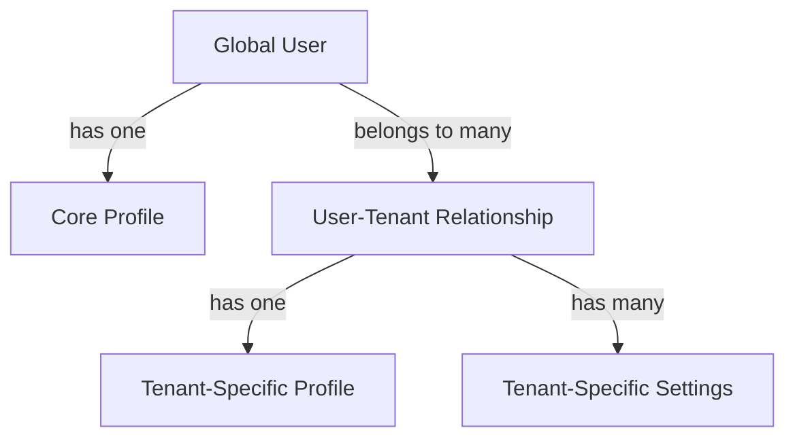

# Tenant Data Isolation

> **Version**: 1.1.0  
> **Last Updated**: 2025-05-23

## Overview

This document defines the strategies and implementation for ensuring complete data isolation between tenants in the multi-tenant architecture.

## Isolation Strategies

### Row-Level Security (RLS)

The primary mechanism for tenant isolation is database-level Row-Level Security:

1. **Tenant ID Column**: All tenant-scoped tables include a `tenant_id` column
2. **RLS Policies**: Automatic filtering based on the current tenant context
3. **Context Setting**: All database connections establish tenant context before operations
4. **Policy Enforcement**: RLS policies evaluate the tenant context for each query

```sql
-- Example RLS policy for tenant isolation
CREATE POLICY tenant_isolation_policy ON tenant_resources
  USING (tenant_id = current_tenant_id());

-- Function to get current tenant context
CREATE OR REPLACE FUNCTION current_tenant_id()
RETURNS UUID AS $$
BEGIN
  RETURN nullif(current_setting('app.current_tenant_id', true), '')::UUID;
END;
$$ LANGUAGE plpgsql STABLE;
```

For detailed implementation examples, see [IMPLEMENTATION_EXAMPLES.md#database-query-layer-examples](IMPLEMENTATION_EXAMPLES.md#database-query-layer-examples).

### Schema-Based Isolation

For sensitive data that requires stronger isolation:

1. **Dynamic Schema Creation**: Each tenant gets a dedicated schema
2. **Schema Routing**: Queries are routed to the appropriate schema based on tenant context
3. **Cross-Schema Prevention**: Direct cross-schema access is prohibited

```sql
-- Dynamic schema routing function
CREATE OR REPLACE FUNCTION get_tenant_schema(tenant_id UUID)
RETURNS TEXT AS $$
BEGIN
  RETURN 'tenant_' || tenant_id::text;
END;
$$ LANGUAGE plpgsql IMMUTABLE;
```

### API-Level Isolation

Tenant isolation is reinforced at the API layer:

1. **Tenant Context Middleware**: All API requests require valid tenant context
2. **Context Verification**: Tenant access is verified for each request
3. **Context Propagation**: Tenant context flows through all service calls

For concrete implementation examples, see [IMPLEMENTATION_EXAMPLES.md#tenant-isolation-in-apis](IMPLEMENTATION_EXAMPLES.md#tenant-isolation-in-apis).

## User Profiles and Tenant-Specific Settings

Each user may interact with multiple tenants, with tenant-specific profiles:

1. **Global Identity**: Users have one authentication record across all tenants
2. **Tenant-Specific Profiles**: Each tenant may extend the user profile with tenant-specific data
3. **Tenant-Specific Settings**: User preferences and settings that apply only in specific tenant contexts



For implementation examples, see [IMPLEMENTATION_EXAMPLES.md#client-side-tenant-management](IMPLEMENTATION_EXAMPLES.md#client-side-tenant-management).

## Cross-Tenant Operations

Some operations need to span tenant boundaries:

1. **Explicit Permission Requirements**: Cross-tenant operations require specific permissions
2. **Audit Logging**: All cross-tenant operations are comprehensively logged
3. **Security Functions**: Cross-tenant operations use security definer functions
4. **Tenant Context Switching**: Explicit context switching with permission verification

For implementation details, see [IMPLEMENTATION_EXAMPLES.md#tenant-provisioning-examples](IMPLEMENTATION_EXAMPLES.md#tenant-provisioning-examples).

## Data Migration Between Tenants

Data migration between tenants requires special handling:

1. **Explicit Permission Check**: Verify permission for cross-tenant data transfer
2. **Data Transformation**: Transform data references to work in new tenant context
3. **Tenant ID Rewriting**: Update tenant ID for all migrated records
4. **Reference Integrity**: Maintain referential integrity during migration

## Integration with Entity Boundaries

Tenant isolation aligns with entity boundaries in the RBAC system:

1. **Tenant as Entity Root**: Each tenant represents a top-level entity boundary
2. **Consistent Boundary Enforcement**: Entity boundaries and tenant isolation use consistent mechanisms
3. **Permission Alignment**: Tenant-specific permissions align with entity permission boundaries

For details on integration with the RBAC system, see [../rbac/ENTITY_BOUNDARIES.md](../rbac/ENTITY_BOUNDARIES.md).

## Testing and Validation

All tenant isolation mechanisms have comprehensive testing:

1. **Isolation Tests**: Verify data cannot be accessed across tenant boundaries
2. **Performance Tests**: Ensure isolation doesn't significantly impact performance
3. **Stress Tests**: Validate isolation under load and high concurrency
4. **Penetration Tests**: Verify isolation can't be circumvented

## Related Documentation

- **[DATABASE_QUERY_PATTERNS.md](DATABASE_QUERY_PATTERNS.md)**: Standardized multi-tenant query patterns
- **[IMPLEMENTATION_EXAMPLES.md](IMPLEMENTATION_EXAMPLES.md)**: Concrete implementation examples
- **[../rbac/ENTITY_BOUNDARIES.md](../rbac/ENTITY_BOUNDARIES.md)**: Entity boundary implementation
- **[../security/MULTI_TENANT_ROLES.md](../security/MULTI_TENANT_ROLES.md)**: Multi-tenant role management
- **[../data-model/entity-relationships/MULTI_TENANT_MODEL.md](../data-model/entity-relationships/MULTI_TENANT_MODEL.md)**: Multi-tenant data model

## Version History

- **1.1.0**: Added references to implementation examples document (2025-05-23)
- **1.0.0**: Initial tenant data isolation documentation
