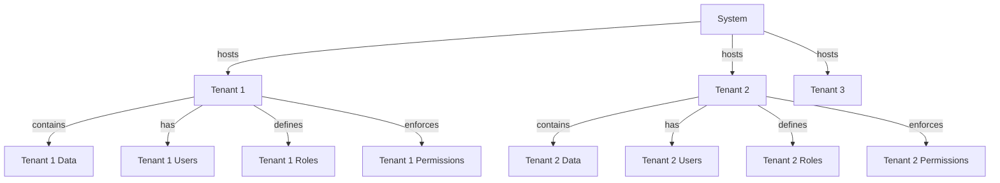

# Multi-Tenant Architecture

> **Version**: 1.1.0  
> **Last Updated**: 2025-05-23

## Overview

This document provides an overview of the multi-tenant architecture implemented across the system. The multi-tenant design allows the application to serve multiple client organizations (tenants) with strong data isolation and tenant-specific customization.

## Key Principles

1. **Complete Data Isolation**: Tenant data is fully isolated with no possibility of data leakage
2. **Shared Infrastructure**: All tenants run on the same infrastructure for efficient resource utilization
3. **Tenant-Specific Customization**: Each tenant can have custom configurations and extensions
4. **Performance Optimization**: System is optimized for multi-tenant operations without sacrificing performance
5. **Cross-Tenant Operations**: Strictly controlled mechanisms allow authorized cross-tenant interactions

## Tenant Model

## Implementation Strategy

The multi-tenant architecture is implemented through these key components:

1. **[DATA_ISOLATION.md](DATA_ISOLATION.md)**: Strategies for ensuring complete tenant data isolation
2. **[DATABASE_QUERY_PATTERNS.md](DATABASE_QUERY_PATTERNS.md)**: Standardized patterns for multi-tenant database queries
3. **[DATABASE_PERFORMANCE.md](DATABASE_PERFORMANCE.md)**: Performance optimizations for multi-tenant database operations
4. **[SESSION_MANAGEMENT.md](SESSION_MANAGEMENT.md)**: Managing user sessions in a multi-tenant context
5. **[PERFORMANCE_OPTIMIZATION.md](PERFORMANCE_OPTIMIZATION.md)**: System-wide optimization strategies for multi-tenant operations
6. **[IMPLEMENTATION_EXAMPLES.md](IMPLEMENTATION_EXAMPLES.md)**: Concrete code examples for implementing multi-tenant features

## Integration with Other Systems

The multi-tenant architecture integrates with:

1. **RBAC System**: Entity boundaries enforce tenant isolation in permissions
2. **Security System**: Multi-tenant roles and session context
3. **Audit System**: Tenant context preserved in all audit logs
4. **UI Framework**: Tenant-aware components and context providers

## Examples and Patterns

For concrete implementation examples of multi-tenant features, see:

- [Database Query Examples](IMPLEMENTATION_EXAMPLES.md#database-query-layer-examples)
- [API Implementation Examples](IMPLEMENTATION_EXAMPLES.md#tenant-isolation-in-apis)
- [UI Implementation Examples](IMPLEMENTATION_EXAMPLES.md#client-side-tenant-management)
- [RBAC Integration Examples](IMPLEMENTATION_EXAMPLES.md#integration-with-rbac-system)
- [Tenant Provisioning Examples](IMPLEMENTATION_EXAMPLES.md#tenant-provisioning-examples)

## Related Documentation

- **[../rbac/ENTITY_BOUNDARIES.md](../rbac/ENTITY_BOUNDARIES.md)**: Entity boundary implementation
- **[../security/MULTI_TENANT_ROLES.md](../security/MULTI_TENANT_ROLES.md)**: Multi-tenant role management
- **[../data-model/entity-relationships/MULTI_TENANT_MODEL.md](../data-model/entity-relationships/MULTI_TENANT_MODEL.md)**: Multi-tenant data model
- **[../data-model/PERMISSION_TENANT_MIGRATIONS.md](../data-model/PERMISSION_TENANT_MIGRATIONS.md)**: Migration strategies for tenant boundaries
- **[../documentation-maps/MULTI_TENANT_MAP.md](../documentation-maps/MULTI_TENANT_MAP.md)**: Documentation map for multi-tenant features

## Version History

- **1.1.0**: Added reference to concrete implementation examples (2025-05-23)
- **1.0.0**: Initial multi-tenant architecture overview
