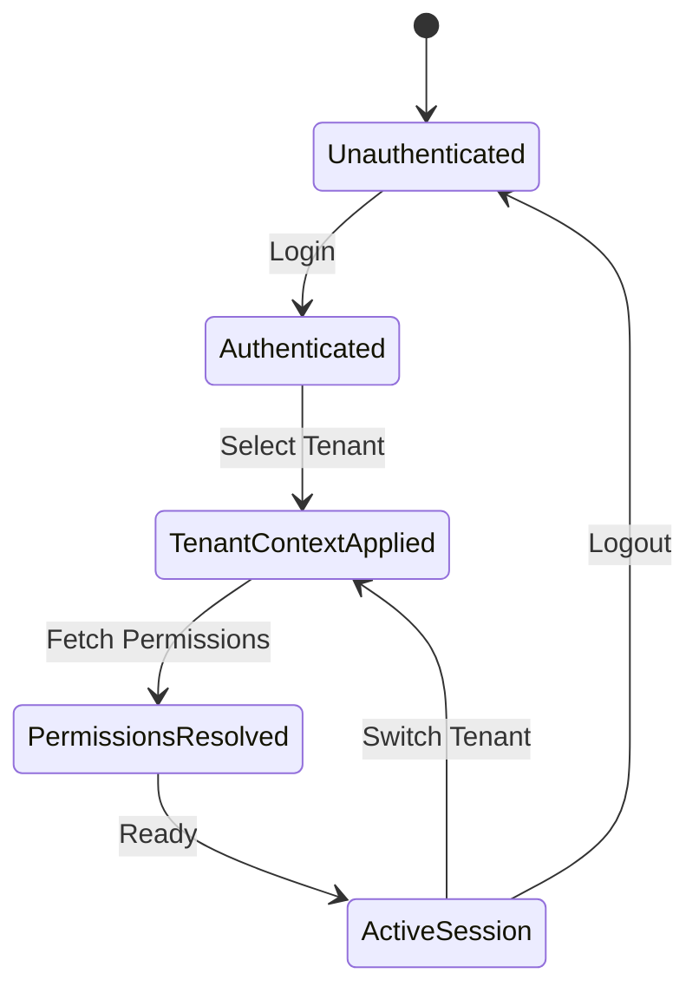

# Multi-tenant Session Management

> **Version**: 1.0.0  
> **Last Updated**: 2025-05-22

## Overview

This document defines the standard patterns for managing user sessions in a multi-tenant environment. It provides implementation details for tenant context persistence, session state handling, and secure tenant switching.

## Session State Architecture

### Core Components

1. **Authentication State**
   - User identity and authentication tokens 
   - JWT payload with minimal claims
   - Refresh token management

2. **Tenant Context**
   - Current active tenant identifier
   - User's role and permissions within current tenant
   - Tenant-specific settings

3. **Resource Access Scope**
   - Scoped access boundaries for the current session
   - Entity-level permissions within the tenant context
   - Feature flags and entitlements

### Session Lifecycle



## Implementation Patterns

### 1. Session Initialization and Recovery

The following pattern ensures reliable session restoration after page reloads or when opening new browser tabs:

```typescript
/**
 * Initialize session state with tenant context recovery
 */
const initializeSessionState = async () => {
  try {
    // 1. Initialize authentication state
    const { data: sessionData } = await supabase.auth.getSession();
    const session = sessionData?.session;
    
    if (!session) {
      // No authenticated session exists
      return null;
    }
    
    // 2. Retrieve tenant context candidates
    const storedTenantId = sessionStorage.getItem('current_tenant_id');
    
    // 3. Get user's available tenants
    const { data: userTenants } = await supabase
      .from('user_tenants')
      .select('tenant_id, tenants(name, settings)')
      .eq('user_id', session.user.id)
      .eq('is_active', true);
      
    const availableTenants = userTenants?.map(ut => ({
      id: ut.tenant_id,
      name: ut.tenants.name,
      settings: ut.tenants.settings
    })) || [];
    
    // 4. Determine which tenant to activate
    let tenantToActivate: string | null = null;
    
    // 4a. First try stored tenant if it's still valid
    if (storedTenantId && availableTenants.some(t => t.id === storedTenantId)) {
      tenantToActivate = storedTenantId;
    } 
    // 4b. Then try user's default tenant from settings
    else {
      const { data: userSettings } = await supabase
        .from('user_settings')
        .select('default_tenant_id')
        .eq('user_id', session.user.id)
        .maybeSingle();
        
      if (userSettings?.default_tenant_id && 
          availableTenants.some(t => t.id === userSettings.default_tenant_id)) {
        tenantToActivate = userSettings.default_tenant_id;
      }
      // 4c. Finally use first available tenant
      else if (availableTenants.length > 0) {
        tenantToActivate = availableTenants[0].id;
      }
    }
    
    // 5. Activate tenant context if available
    if (tenantToActivate) {
      await activateTenantContext(tenantToActivate, session.user.id);
    }
    
    return {
      session,
      currentTenantId: tenantToActivate,
      availableTenants
    };
  } catch (error) {
    console.error('Error initializing session:', error);
    return null;
  }
};
```

### 2. Tenant Context Activation

This pattern establishes a reliable way to activate tenant context and ensure it's properly persisted:

```typescript
/**
 * Activate a tenant context for the current session
 */
const activateTenantContext = async (tenantId: string, userId: string): Promise<boolean> => {
  try {
    // 1. Verify user has access to the tenant
    const { data: access } = await supabase
      .from('user_tenants')
      .select('id')
      .eq('user_id', userId)
      .eq('tenant_id', tenantId)
      .eq('is_active', true)
      .maybeSingle();
      
    if (!access) {
      throw new Error('User does not have access to this tenant');
    }
    
    // 2. Set tenant context at database level
    await supabase.rpc('set_tenant_context', { tenant_id: tenantId });
    
    // 3. Persist tenant context for session recovery
    sessionStorage.setItem('current_tenant_id', tenantId);
    
    // 4. Optionally update user's default tenant setting
    await supabase
      .from('user_settings')
      .upsert(
        { user_id: userId, default_tenant_id: tenantId },
        { onConflict: 'user_id' }
      );
      
    // 5. Log tenant context change for audit
    await supabase.from('session_context_changes')
      .insert({
        user_id: userId,
        tenant_id: tenantId,
        event_type: 'TENANT_ACTIVATED',
        metadata: {
          source: 'web_client',
          timestamp: new Date().toISOString()
        }
      });
    
    // 6. Dispatch event for client-side components to react
    window.dispatchEvent(new CustomEvent('tenantContextChanged', {
      detail: { tenantId }
    }));
    
    return true;
  } catch (error) {
    console.error('Error activating tenant context:', error);
    return false;
  }
};
```

### 3. React Hook for Tenant Context

This hook provides a clean interface for components to interact with the tenant context:

```typescript
/**
 * Custom hook for managing tenant context in React components
 */
export function useTenantContext() {
  const [currentTenantId, setCurrentTenantId] = useState<string | null>(null);
  const [availableTenants, setAvailableTenants] = useState<Tenant[]>([]);
  const [isLoading, setIsLoading] = useState(true);
  const { session, user } = useAuth();
  
  // Load available tenants and current tenant
  useEffect(() => {
    const loadTenantContext = async () => {
      if (!user?.id) {
        setCurrentTenantId(null);
        setAvailableTenants([]);
        setIsLoading(false);
        return;
      }
      
      try {
        setIsLoading(true);
        
        // Load available tenants
        const { data: userTenants, error } = await supabase
          .from('user_tenants')
          .select('tenant_id, tenants(id, name, settings)')
          .eq('user_id', user.id)
          .eq('is_active', true);
          
        if (error) throw error;
        
        const tenants = userTenants.map(ut => ({
          id: ut.tenant_id,
          name: ut.tenants.name,
          settings: ut.tenants.settings
        }));
        
        setAvailableTenants(tenants);
        
        // Get current tenant from storage or settings
        const storedTenantId = sessionStorage.getItem('current_tenant_id');
        
        if (storedTenantId && tenants.some(t => t.id === storedTenantId)) {
          setCurrentTenantId(storedTenantId);
        } else {
          // Try to get default from settings
          const { data: settings } = await supabase
            .from('user_settings')
            .select('default_tenant_id')
            .eq('user_id', user.id)
            .maybeSingle();
            
          const defaultId = settings?.default_tenant_id;
          
          if (defaultId && tenants.some(t => t.id === defaultId)) {
            await switchTenant(defaultId);
          } else if (tenants.length > 0) {
            await switchTenant(tenants[0].id);
          }
        }
      } catch (error) {
        console.error('Error loading tenant context:', error);
      } finally {
        setIsLoading(false);
      }
    };
    
    loadTenantContext();
  }, [user?.id]);
  
  // Function to switch tenant context
  const switchTenant = useCallback(async (tenantId: string) => {
    if (!user?.id) return false;
    
    try {
      const success = await activateTenantContext(tenantId, user.id);
      
      if (success) {
        setCurrentTenantId(tenantId);
      }
      
      return success;
    } catch (error) {
      console.error('Error switching tenant:', error);
      return false;
    }
  }, [user?.id]);
  
  // Listen for tenant context changes from other parts of the app
  useEffect(() => {
    const handleTenantContextChange = (event: CustomEvent) => {
      setCurrentTenantId(event.detail.tenantId);
    };
    
    window.addEventListener(
      'tenantContextChanged',
      handleTenantContextChange as EventListener
    );
    
    return () => {
      window.removeEventListener(
        'tenantContextChanged',
        handleTenantContextChange as EventListener
      );
    };
  }, []);
  
  return {
    currentTenantId,
    availableTenants,
    switchTenant,
    isLoading
  };
}
```

### 4. Session Context Provider

To make tenant context available throughout the app:

```typescript
/**
 * Provider component for multi-tenant session context
 */
export const SessionProvider: React.FC<{ children: React.ReactNode }> = ({ children }) => {
  const { session, user } = useAuth();
  const {
    currentTenantId,
    availableTenants,
    switchTenant,
    isLoading: tenantsLoading
  } = useTenantContext();
  const [permissions, setPermissions] = useState<Permission[]>([]);
  const [permissionsLoading, setPermissionsLoading] = useState(true);
  
  // Load user permissions for current tenant
  useEffect(() => {
    const loadPermissions = async () => {
      if (!user?.id || !currentTenantId) {
        setPermissions([]);
        setPermissionsLoading(false);
        return;
      }
      
      try {
        setPermissionsLoading(true);
        
        await supabase.rpc('set_tenant_context', { tenant_id: currentTenantId });
        
        const { data, error } = await supabase.rpc(
          'get_user_permissions_in_tenant',
          {
            p_user_id: user.id,
            p_tenant_id: currentTenantId
          }
        );
        
        if (error) throw error;
        
        setPermissions(data || []);
      } catch (error) {
        console.error('Error loading permissions:', error);
        setPermissions([]);
      } finally {
        setPermissionsLoading(false);
      }
    };
    
    loadPermissions();
  }, [user?.id, currentTenantId]);
  
  // Check if a user has a specific permission
  const hasPermission = useCallback((
    action: string,
    resource: string,
    resourceId?: string
  ): boolean => {
    if (!permissions.length) return false;
    
    return permissions.some(p => 
      p.action === action && 
      p.resource === resource &&
      (!resourceId || p.resource_id === resourceId || p.resource_id === '*')
    );
  }, [permissions]);
  
  const contextValue = {
    session,
    user,
    currentTenantId,
    availableTenants,
    switchTenant,
    permissions,
    hasPermission,
    isLoading: tenantsLoading || permissionsLoading
  };
  
  return (
    <SessionContext.Provider value={contextValue}>
      {children}
    </SessionContext.Provider>
  );
};
```

## Database Session Context Management

This section covers how to implement database-level session context management:

### 1. Session Context Variables

Configure PostgreSQL to manage tenant context through session variables:

```sql
-- Create schema for session context functions
CREATE SCHEMA IF NOT EXISTS session_context;

-- Create function to set tenant context
CREATE OR REPLACE FUNCTION session_context.set_tenant_context(tenant_id UUID)
RETURNS void
LANGUAGE plpgsql
SECURITY DEFINER
AS $$
BEGIN
  -- Store tenant ID in session-level variable
  PERFORM set_config('app.current_tenant_id', tenant_id::text, false);
  
  -- Also store last tenant change timestamp
  PERFORM set_config(
    'app.tenant_context_set_at', 
    extract(epoch from now())::text,
    false
  );
END;
$$;

-- Create function to get current tenant
CREATE OR REPLACE FUNCTION session_context.get_current_tenant_id()
RETURNS UUID
LANGUAGE plpgsql
STABLE
SECURITY DEFINER
AS $$
DECLARE
  tenant_id UUID;
BEGIN
  -- Get tenant ID from session variable
  tenant_id := current_setting('app.current_tenant_id', true)::UUID;
  RETURN tenant_id;
EXCEPTION WHEN OTHERS THEN
  -- Return NULL if no tenant context is set
  RETURN NULL;
END;
$$;

-- Function to check if tenant context is valid
CREATE OR REPLACE FUNCTION session_context.validate_tenant_context()
RETURNS BOOLEAN
LANGUAGE plpgsql
STABLE
SECURITY DEFINER
AS $$
DECLARE
  tenant_id UUID;
  context_age NUMERIC;
  max_age CONSTANT NUMERIC := 3600; -- 1 hour in seconds
BEGIN
  -- Get tenant ID from session variable
  tenant_id := session_context.get_current_tenant_id();
  
  -- Check if tenant ID is set
  IF tenant_id IS NULL THEN
    RETURN FALSE;
  END IF;
  
  -- Check if tenant context is not too old
  context_age := extract(epoch from now()) - 
                 current_setting('app.tenant_context_set_at', true)::NUMERIC;
                 
  IF context_age > max_age THEN
    RETURN FALSE;
  END IF;
  
  -- Check if tenant exists
  PERFORM 1 FROM tenants WHERE id = tenant_id;
  RETURN FOUND;
END;
$$;
```

### 2. Row-Level Security With Session Context

Implement RLS policies that enforce tenant isolation using session context:

```sql
-- Apply RLS to multi-tenant table
ALTER TABLE tenant_resources ENABLE ROW LEVEL SECURITY;

-- Create policy that uses session context
CREATE POLICY tenant_isolation_policy
ON tenant_resources
FOR ALL
USING (
  -- Use session context function to get tenant ID
  tenant_id = session_context.get_current_tenant_id()
  -- Validate tenant context is properly set
  AND session_context.validate_tenant_context() = TRUE 
);
```

## Session Security Patterns

### 1. Secure Tenant Switching

To prevent unauthorized tenant access, implement this pattern:

```typescript
/**
 * Secure tenant switching with verification
 */
const secureTenantSwitch = async (
  tenantId: string, 
  userId: string,
  securityToken: string
): Promise<boolean> => {
  try {
    // 1. Verify security token to prevent CSRF
    const isValidToken = await validateSecurityToken(securityToken);
    
    if (!isValidToken) {
      throw new Error('Invalid security token');
    }
    
    // 2. Verify user belongs to tenant
    const { data: membership, error: membershipError } = await supabase
      .from('user_tenants')
      .select('id, role_id')
      .eq('user_id', userId)
      .eq('tenant_id', tenantId)
      .eq('is_active', true)
      .maybeSingle();
      
    if (membershipError || !membership) {
      throw new Error('User does not have access to this tenant');
    }
    
    // 3. Log tenant switch for security audit
    await supabase.from('security_audit_logs').insert({
      user_id: userId,
      event_type: 'TENANT_SWITCH',
      resource_type: 'tenant',
      resource_id: tenantId,
      metadata: {
        previous_tenant_id: sessionStorage.getItem('current_tenant_id') || null,
        role_id: membership.role_id,
        client_ip: await fetchClientIP(),
        user_agent: navigator.userAgent
      }
    });
    
    // 4. Set tenant context and update persistence
    await supabase.rpc('set_tenant_context', { tenant_id: tenantId });
    sessionStorage.setItem('current_tenant_id', tenantId);
    
    // 5. Update default tenant if requested
    const makeDefault = localStorage.getItem('remember_tenant_choice') === 'true';
    
    if (makeDefault) {
      await supabase
        .from('user_settings')
        .upsert(
          { user_id: userId, default_tenant_id: tenantId },
          { onConflict: 'user_id' }
        );
    }
    
    // 6. Notify application of context change
    window.dispatchEvent(new CustomEvent('tenantContextChanged', {
      detail: { tenantId, timestamp: Date.now() }
    }));
    
    return true;
  } catch (error) {
    console.error('Secure tenant switch failed:', error);
    return false;
  }
};
```

### 2. Session Context Expiration

Implement auto-expiry for tenant context sessions:

```typescript
/**
 * Monitor and refresh tenant context to prevent session expiry
 */
function useTenantContextRefresh() {
  const { currentTenantId, user } = useTenantSession();
  
  useEffect(() => {
    if (!currentTenantId || !user?.id) return;
    
    // Refresh tenant context periodically (every 15 minutes)
    const interval = setInterval(async () => {
      try {
        // Refresh tenant context on the server
        await supabase.rpc('set_tenant_context', {
          tenant_id: currentTenantId
        });
        
        console.log('Tenant context refreshed:', currentTenantId);
      } catch (error) {
        console.error('Error refreshing tenant context:', error);
      }
    }, 15 * 60 * 1000); // 15 minutes
    
    return () => clearInterval(interval);
  }, [currentTenantId, user?.id]);
}
```

## Tenant Session Interface Components

### 1. Tenant Selector Component

```typescript
/**
 * Tenant selector component for switching between tenants
 */
export const TenantSelector: React.FC = () => {
  const { currentTenantId, availableTenants, switchTenant } = useTenantContext();
  const [isChanging, setIsChanging] = useState(false);
  
  const handleTenantChange = async (tenantId: string) => {
    try {
      setIsChanging(true);
      
      // Generate security token for CSRF protection
      const securityToken = await generateSecurityToken();
      
      // Switch tenant context with security verification
      await secureTenantSwitch(
        tenantId,
        auth.currentUser?.id,
        securityToken
      );
      
      // Reset UI state after successful switch
      setIsChanging(false);
    } catch (error) {
      console.error('Error switching tenant:', error);
      setIsChanging(false);
    }
  };
  
  // Group tenants by type for organization
  const groupedTenants = availableTenants.reduce((groups, tenant) => {
    const type = tenant.settings?.type || 'default';
    return {
      ...groups,
      [type]: [...(groups[type] || []), tenant]
    };
  }, {} as Record<string, Tenant[]>);
  
  return (
    <div className="tenant-selector">
      <h3>Your Organizations</h3>
      
      {isChanging ? (
        <div className="loading">Switching tenant context...</div>
      ) : (
        Object.entries(groupedTenants).map(([type, tenants]) => (
          <div key={type} className="tenant-group">
            <div className="group-label">{type}</div>
            
            {tenants.map(tenant => (
              <button
                key={tenant.id}
                className={`tenant-item ${currentTenantId === tenant.id ? 'active' : ''}`}
                onClick={() => handleTenantChange(tenant.id)}
              >
                <div className="tenant-name">{tenant.name}</div>
                {currentTenantId === tenant.id && (
                  <span className="current-indicator">Current</span>
                )}
              </button>
            ))}
          </div>
        ))
      )}
    </div>
  );
};
```

### 2. Tenant Context Header

```typescript
/**
 * Header component that displays current tenant and allows switching
 */
export const TenantContextHeader: React.FC = () => {
  const { currentTenantId, availableTenants } = useTenantContext();
  const [isMenuOpen, setIsMenuOpen] = useState(false);
  
  // Find current tenant details
  const currentTenant = availableTenants.find(
    t => t.id === currentTenantId
  );
  
  return (
    <div className="tenant-context-header">
      <div className="current-tenant" onClick={() => setIsMenuOpen(!isMenuOpen)}>
        {currentTenant ? (
          <>
            <div className="tenant-logo">
              {currentTenant.settings?.logoUrl ? (
                
              ) : (
                <div className="tenant-logo-placeholder">
                  {currentTenant.name.substring(0, 2).toUpperCase()}
                </div>
              )}
            </div>
            <div className="tenant-info">
              <div className="tenant-name">{currentTenant.name}</div>
              <div className="tenant-role">
                {currentTenant.settings?.userRole || 'Member'}
              </div>
            </div>
            <div className="tenant-selector-toggle">↓</div>
          </>
        ) : (
          <div className="no-tenant">No organization selected</div>
        )}
      </div>
      
      {isMenuOpen && (
        <div className="tenant-menu">
          <TenantSelector />
        </div>
      )}
    </div>
  );
};
```

## Related Documentation

- **[DATABASE_QUERY_PATTERNS.md](DATABASE_QUERY_PATTERNS.md)**: Canonical pattern for multi-tenant database queries
- **[DATA_ISOLATION.md](DATA_ISOLATION.md)**: Tenant data isolation architecture
- **[../security/MULTI_TENANT_ROLES.md](../security/MULTI_TENANT_ROLES.md)**: Multi-tenant role management
- **[../user-management/USER_EXTENSIONS.md](../user-management/USER_EXTENSIONS.md)**: User extension mechanisms
- **[../security/AUTH_SYSTEM.md](../security/AUTH_SYSTEM.md)**: Authentication system documentation
- **[../rbac/PERMISSION_RESOLUTION.md](../rbac/PERMISSION_RESOLUTION.md)**: Permission resolution process

## Version History

- **1.0.0**: Initial version defining session management patterns for multi-tenant applications (2025-05-22)
