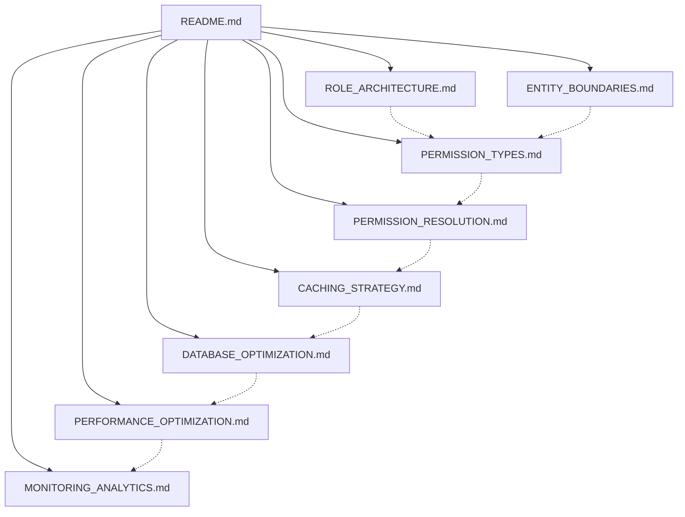
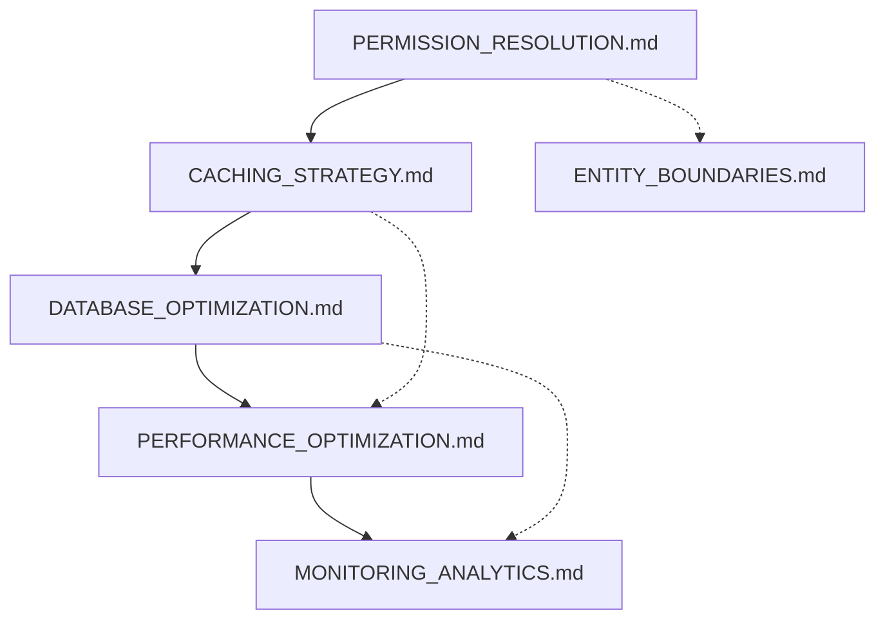
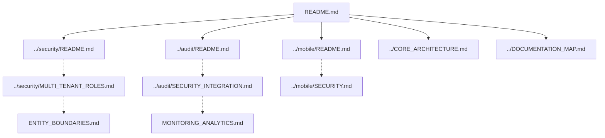

# RBAC Documentation Map

> **Version**: 1.0.0  
> **Last Updated**: 2025-05-20

This document provides a visual guide to the relationships between RBAC documentation files.

## Core Documentation Structure

```
rbac/
├── README.md                      # Entry point and overview
├── DOCUMENTATION_MAP.md           # This file - navigation guide
├── ROLE_ARCHITECTURE.md           # Role definition and structure
├── PERMISSION_TYPES.md            # Permission taxonomy and implementation
├── PERMISSION_RESOLUTION.md       # How permissions are resolved for users
├── ENTITY_BOUNDARIES.md           # Entity-level permission isolation
├── CACHING_STRATEGY.md            # Multi-level caching approach
├── DATABASE_OPTIMIZATION.md       # Database design for permissions
├── PERFORMANCE_OPTIMIZATION.md    # Performance techniques
└── MONITORING_ANALYTICS.md        # Monitoring and analytics
```

## Document Relationships

### Core RBAC Architecture



### Implementation Relationships



## Integration with Other Systems



## Navigation Guide

1. Start with **[README.md](README.md)** for a high-level overview of the RBAC system
2. For **role management**, continue to **[ROLE_ARCHITECTURE.md](ROLE_ARCHITECTURE.md)**
3. For **permission types**, see **[PERMISSION_TYPES.md](PERMISSION_TYPES.md)**
4. For **permission resolution**, refer to **[PERMISSION_RESOLUTION.md](PERMISSION_RESOLUTION.md)**
5. For **multi-tenant boundaries**, check **[ENTITY_BOUNDARIES.md](ENTITY_BOUNDARIES.md)**
6. For **performance and optimization**:
   - **[CACHING_STRATEGY.md](CACHING_STRATEGY.md)**: Caching implementation
   - **[DATABASE_OPTIMIZATION.md](DATABASE_OPTIMIZATION.md)**: Database design
   - **[PERFORMANCE_OPTIMIZATION.md](PERFORMANCE_OPTIMIZATION.md)**: Advanced optimization
7. For **monitoring and analytics**, see **[MONITORING_ANALYTICS.md](MONITORING_ANALYTICS.md)**

## Integration Points

- **Security System**: The RBAC system integrates with the security implementation documented in **[../security/README.md](../security/README.md)**
- **Audit System**: Permission changes are logged through the audit system detailed in **[../audit/README.md](../audit/README.md)**
- **Mobile Platform**: Mobile-specific permission considerations are covered in **[../mobile/README.md](../mobile/README.md)**

## Version History

- **1.0.0**: Initial document created for RBAC system documentation
