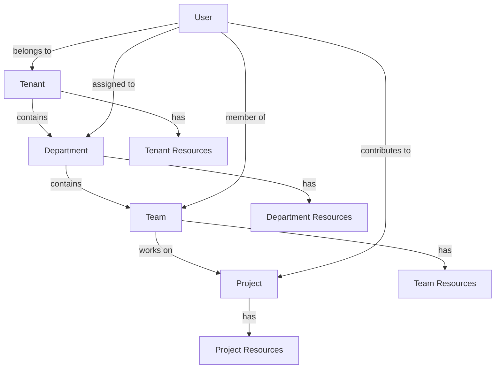

# Entity Boundaries in Permission Resolution

> **Version**: 1.0.0  
> **Last Updated**: 2025-05-22

## Overview

This document explains how entity boundaries are enforced during permission resolution, ensuring that users can only access resources within their authorized entity contexts.

## Entity Boundary Concept

Entity boundaries represent logical isolation between different organizational units (tenants, departments, teams) within the system. The key principles are:

1. **Boundary Enforcement**: Users cannot access resources outside their authorized entities
2. **Explicit Cross-Entity Access**: Cross-entity operations require special permissions
3. **Entity Context**: All operations occur in the context of a specific entity
4. **Permission Isolation**: Permissions granted in one entity do not apply to others

## Entity Types and Hierarchy

The system supports these entity boundary types:

1. **Tenant Boundaries**: Primary isolation between separate tenant organizations
2. **Department Boundaries**: Sub-isolation within tenant organizations
3. **Team Boundaries**: Finest-grained isolation for specific workgroups
4. **Project Boundaries**: Resource-specific boundaries for collaboration



## Boundary Enforcement in Permission Resolution

### Tenant Boundary Enforcement

The primary entity boundary is the tenant, enforced through tenant context:

```typescript
async function resolvePermissionWithBoundary(
  userId: string,
  actionKey: string,
  resourceType: string,
  resourceId?: string
): Promise<boolean> {
  // Get current tenant context
  const tenantId = getCurrentTenantContext();
  if (!tenantId) {
    return false; // No tenant context, cannot proceed
  }
  
  // Verify user belongs to this tenant
  const hasAccess = await userBelongsToTenant(userId, tenantId);
  if (!hasAccess) {
    return false; // User doesn't belong to the current tenant
  }
  
  // If resource ID is provided, verify resource belongs to this tenant
  if (resourceId) {
    const resourceInTenant = await resourceBelongsToTenant(resourceId, tenantId);
    if (!resourceInTenant) {
      return false; // Resource doesn't belong to current tenant
    }
  }
  
  // Now proceed with normal permission resolution
  return await resolvePermission(userId, actionKey, resourceType, resourceId, tenantId);
}
```

### Database-Level Boundary Enforcement

Tenant boundaries are enforced at the database level through Row-Level Security:

```sql
-- Enable RLS on tenant-scoped resources
ALTER TABLE tenant_resources ENABLE ROW LEVEL SECURITY;

-- Create tenant isolation policy
CREATE POLICY tenant_isolation_policy ON tenant_resources
FOR ALL USING (tenant_id = current_tenant_id());

-- Function to get current tenant context
CREATE OR REPLACE FUNCTION current_tenant_id()
RETURNS UUID AS $$
BEGIN
  RETURN nullif(current_setting('app.current_tenant_id', true), '')::UUID;
END;
$$ LANGUAGE plpgsql STABLE;
```

## Entity Administrator Boundaries

Entity administrators have special permissions within their entity boundaries:

1. **Entity Admin Constraints**:
   - Entity admins can only grant permissions they possess
   - Cannot assign roles with permissions they don't have
   - Cannot extend permissions outside their entity
   - Can manage resources only within their entity

2. **Permission Validation**:
   ```typescript
   // Check if administrator can grant a role (has all permissions in that role)
   async function canGrantRole(
     adminUserId: string,
     roleId: string,
     tenantId: string
   ): Promise<boolean> {
     // Get all permissions in the role
     const rolePermissions = await getRolePermissions(roleId);
     
     // Check if admin has all these permissions
     for (const permission of rolePermissions) {
       const hasPermission = await resolvePermission(
         adminUserId,
         permission.action,
         permission.resourceType,
         undefined,
         tenantId
       );
       
       if (!hasPermission) {
         return false; // Admin missing at least one permission
       }
     }
     
     return true; // Admin has all permissions in the role
   }
   ```

## Cross-Entity Operations

Some operations need to span entity boundaries. These are handled through:

1. **Cross-Entity Permissions**:
   - Special permission types for cross-entity operations
   - Explicitly granted to authorized users
   - Logged for security audit
   - Limited scope and duration

2. **Cross-Entity Functions**:
   ```sql
   -- Function for cross-tenant operations (highly restricted)
   CREATE OR REPLACE FUNCTION copy_resource_cross_tenant(
     source_resource_id UUID,
     source_tenant_id UUID,
     target_tenant_id UUID
   ) RETURNS UUID
   LANGUAGE plpgsql
   SECURITY DEFINER
   AS $$
   DECLARE
     new_resource_id UUID;
     has_permission BOOLEAN;
   BEGIN
     -- Verify current user has cross-tenant admin permission
     SELECT EXISTS (
       SELECT 1
       FROM permissions p
       JOIN role_permissions rp ON p.id = rp.permission_id
       JOIN user_roles ur ON rp.role_id = ur.role_id
       WHERE p.action = 'CrossTenantAdmin'
       AND ur.user_id = auth.uid()
     ) INTO has_permission;
     
     IF NOT has_permission THEN
       RAISE EXCEPTION 'Permission denied for cross-tenant operation';
     END IF;
     
     -- Implement cross-tenant operation
     -- ...
     
     -- Log the cross-tenant operation for audit
     -- ...
     
     RETURN new_resource_id;
   END;
   $$;
   ```

## Boundary Context Switching

Users can switch between entity contexts if they have access to multiple entities:

1. **Context Switching Process**:
   - Validate user's membership in target entity
   - Switch database session context
   - Clear permission cache
   - Re-evaluate UI permissions
   - Log context switch

2. **Implementation**:
   ```typescript
   // Switch tenant context
   async function switchTenantContext(userId: string, newTenantId: string): Promise<boolean> {
     // Verify user has access to target tenant
     const hasAccess = await userBelongsToTenant(userId, newTenantId);
     if (!hasAccess) {
       return false;
     }
     
     // Set tenant context in database session
     await setDatabaseTenantContext(newTenantId);
     
     // Update application context
     setCurrentTenant(newTenantId);
     
     // Clear permission cache to force recalculation with new context
     permissionCache.clear();
     
     // Log context switch for audit
     await logTenantSwitch(userId, newTenantId);
     
     return true;
   }
   ```

## Entity Boundary Testing

The permission system includes comprehensive tests for entity boundaries:

1. **Boundary Enforcement Tests**:
   - Verify users cannot access resources outside their entities
   - Confirm entity admins cannot grant access outside boundaries
   - Test isolation between tenant data

2. **Cross-Entity Tests**:
   - Validate cross-entity operations with proper permissions
   - Verify cross-entity operations fail without permissions
   - Test audit logging of boundary-crossing operations

## Related Documentation

- **[PERMISSION_MODEL.md](PERMISSION_MODEL.md)**: Core permission model
- **[RESOLUTION_ALGORITHM.md](RESOLUTION_ALGORITHM.md)**: Permission resolution algorithm
- **[IMPLEMENTATION.md](IMPLEMENTATION.md)**: Implementation details
- **[../ENTITY_BOUNDARIES.md](../ENTITY_BOUNDARIES.md)**: Broader entity boundary documentation
- **[../../multitenancy/DATA_ISOLATION.md](../../multitenancy/DATA_ISOLATION.md)**: Tenant data isolation

## Version History

- **1.0.0**: Initial document creation from permission resolution refactoring (2025-05-22)
