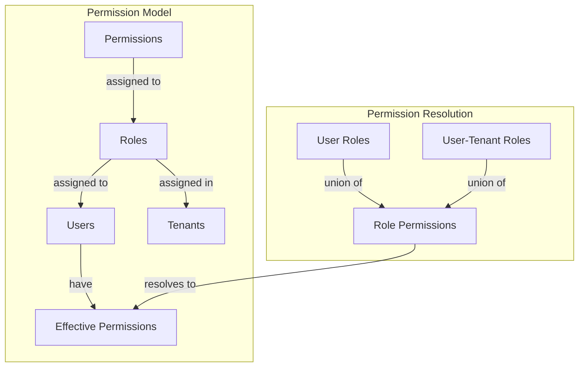

# Permission Model

> **Version**: 1.2.0  
> **Last Updated**: 2025-05-22

## Overview

This document defines the core permission assignment model and its characteristics within the Role-Based Access Control (RBAC) system.

## Direct Permission Assignment Model

The RBAC system uses a **direct permission assignment model** with the following key characteristics:

1. **Flat Permission Structure**: Permissions are directly assigned to roles without hierarchical inheritance
2. **Union-Based Resolution**: Users with multiple roles have the union of all permissions from their roles
3. **Explicit Permissions**: All permissions must be explicitly granted to roles

### Comparison with Hierarchical Models

Unlike hierarchical models, the direct permission assignment model:
- Does not support cascading permissions through role hierarchy
- Requires explicit permission grants for each role
- Simplifies permission resolution (no need to traverse role hierarchies)
- Provides clearer security boundaries and audit trails

## Permission Assignment Architecture



### Permission Units

The fundamental units in the permission model are:

1. **Resources**: Entities in the system that can be protected
   - Examples: users, roles, tenants, reports, settings

2. **Actions**: Operations that can be performed on resources
   - Standard actions: View, ViewAny, Create, Update, Delete
   - Resource-specific actions: Publish, Approve, Clone, Export

3. **Permissions**: Combination of a resource and an action
   - Example: `users:create`, `reports:view`, `settings:update`

### Permission Storage

Permissions are stored in the database with these key relationships:

```sql
-- Resources table
CREATE TABLE resources (
  id UUID PRIMARY KEY DEFAULT uuid_generate_v4(),
  name TEXT NOT NULL,
  description TEXT,
  created_at TIMESTAMP WITH TIME ZONE DEFAULT now(),
  updated_at TIMESTAMP WITH TIME ZONE DEFAULT now()
);

-- Resource permission actions (available actions for each resource)
CREATE TABLE resource_permission_actions (
  id UUID PRIMARY KEY DEFAULT uuid_generate_v4(),
  resource_id UUID NOT NULL REFERENCES resources(id) ON DELETE CASCADE,
  action_key TEXT NOT NULL,
  action_name TEXT NOT NULL,
  description TEXT NOT NULL,
  is_active BOOLEAN NOT NULL DEFAULT true,
  created_at TIMESTAMP WITH TIME ZONE DEFAULT now(),
  updated_at TIMESTAMP WITH TIME ZONE DEFAULT now(),
  UNIQUE(resource_id, action_key)
);

-- Permissions (combinations of resources and actions)
CREATE TABLE permissions (
  id UUID PRIMARY KEY DEFAULT uuid_generate_v4(),
  resource_id UUID NOT NULL REFERENCES resources(id) ON DELETE CASCADE,
  action TEXT NOT NULL,
  created_at TIMESTAMP WITH TIME ZONE DEFAULT now(),
  updated_at TIMESTAMP WITH TIME ZONE DEFAULT now(),
  UNIQUE(resource_id, action)
);

-- Role permissions (assigned permissions to roles)
CREATE TABLE role_permissions (
  id UUID PRIMARY KEY DEFAULT uuid_generate_v4(),
  role_id UUID NOT NULL REFERENCES roles(id) ON DELETE CASCADE,
  permission_id UUID NOT NULL REFERENCES permissions(id) ON DELETE CASCADE,
  created_by UUID REFERENCES auth.users(id),
  created_at TIMESTAMP WITH TIME ZONE DEFAULT now(),
  UNIQUE(role_id, permission_id)
);
```

## Permission Relationships

### Functional Dependencies

While the model does not use hierarchical inheritance, it recognizes functional dependencies between permissions:

1. **Implied Capabilities**: Some permissions logically imply others
   - Example: `ViewAny` implies capability for `View` operations
   - Example: `Update` implies capability for `View` operations

2. **Resource Relationships**: Resources may have parent-child relationships
   - Example: Access to a dashboard may imply access to its widgets
   - Example: Organization admin may have access to department resources

3. **Action Hierarchy**: Some actions are more powerful than others
   - Example: `ManagePermissions` is more powerful than `Update`
   - Example: `DeleteAny` is more powerful than `Delete` for a single resource

For a comprehensive definition of these functional dependencies, see [../PERMISSION_DEPENDENCIES.md](../PERMISSION_DEPENDENCIES.md).

While these relationships exist conceptually, they are not automatically enforced by the system. Instead, they guide permission assignment by administrators and are enforced through application logic when relevant.

## Permission Groups

For administrative convenience, permissions can be logically grouped:

1. **Resource-Based Groups**: All permissions related to a specific resource
   - Example: All user management permissions
   - Example: All report permissions

2. **Function-Based Groups**: Permissions across resources for a specific function
   - Example: All View permissions across resources
   - Example: All administrative permissions

3. **Role Templates**: Pre-configured sets of permissions for common roles
   - Example: Content Editor template with content management permissions
   - Example: Department Manager template with department-scoped permissions

## Special Permission Cases

### SuperAdmin Role

The SuperAdmin role has a special exemption from normal permission checks:

```typescript
// SuperAdmin permission check bypass
async function hasPermission(userId: string, action: string, resource: string): Promise<boolean> {
  // Check if user is SuperAdmin
  const isSuperAdmin = await checkSuperAdminRole(userId);
  
  // SuperAdmin always has all permissions
  if (isSuperAdmin) {
    return true;
  }
  
  // Normal permission resolution for non-SuperAdmin users
  return await checkUserPermission(userId, action, resource);
}
```

### System Resources

System-level resources have special protection:
- Cannot be created, updated, or deleted by normal users
- Protected by database-level security mechanisms
- Only accessible to SuperAdmin and system processes

## Related Documentation

- **[RESOLUTION_ALGORITHM.md](RESOLUTION_ALGORITHM.md)**: Algorithm for resolving permissions
- **[../PERMISSION_TYPES.md](../PERMISSION_TYPES.md)**: Permission taxonomy
- **[../PERMISSION_DEPENDENCIES.md](../PERMISSION_DEPENDENCIES.md)**: Explicit definition of permission functional dependencies
- **[../ROLE_ARCHITECTURE.md](../ROLE_ARCHITECTURE.md)**: Role definition and structure
- **[ENTITY_BOUNDARIES.md](ENTITY_BOUNDARIES.md)**: Entity-level permission boundaries
- **[IMPLEMENTATION.md](IMPLEMENTATION.md)**: Implementation details

## Version History

- **1.2.0**: Added more comprehensive reference to PERMISSION_DEPENDENCIES.md (2025-05-22)
- **1.1.0**: Added reference to PERMISSION_DEPENDENCIES.md (2025-05-22)
- **1.0.0**: Initial document creation from permission resolution refactoring (2025-05-22)
