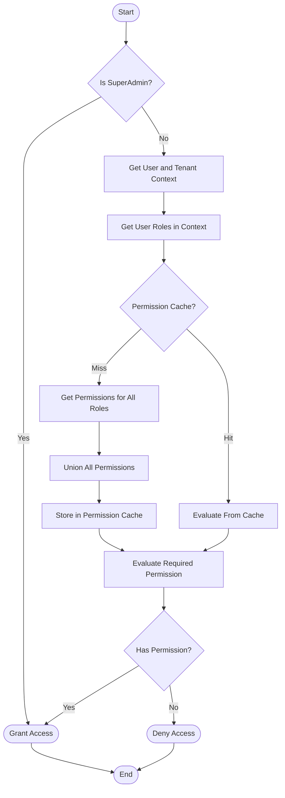

# Permission Resolution Algorithm

> **Version**: 1.0.0  
> **Last Updated**: 2025-05-22

## Overview

This document details the algorithm used to resolve permissions for a user in a specific context. The permission resolution process determines whether a user has access to perform a specific action on a resource.

## Resolution Process

The permission resolution algorithm follows these key steps:

1. **Context Establishment**: Determine user and tenant context
2. **Role Collection**: Gather all roles assigned to the user
3. **Permission Aggregation**: Collect all permissions from those roles
4. **Permission Evaluation**: Check if the required permission exists in the aggregated set
5. **Decision**: Grant or deny access based on the evaluation

### Detailed Resolution Flow



## Algorithm Pseudocode

```typescript
/**
 * Resolve whether a user has a specific permission
 */
async function resolvePermission(
  userId: string,
  actionKey: string,
  resourceType: string,
  resourceId?: string,
  tenantId?: string
): Promise<boolean> {
  // 1. SuperAdmin check (always returns true for SuperAdmins)
  if (await isSuperAdmin(userId)) {
    return true;
  }
  
  // 2. Get effective tenant context
  const effectiveTenantId = tenantId || await getCurrentTenantContext(userId);
  if (!effectiveTenantId) {
    return false; // No tenant context, cannot resolve permissions
  }
  
  // 3. Check permission cache
  const cacheKey = `${userId}:${effectiveTenantId}:${resourceType}:${actionKey}`;
  const cachedResult = permissionCache.get(cacheKey);
  if (cachedResult !== undefined) {
    return cachedResult;
  }
  
  // 4. Get all roles for the user in this tenant
  const roles = await getUserRolesInTenant(userId, effectiveTenantId);
  
  // 5. If no roles, user has no permissions
  if (roles.length === 0) {
    permissionCache.set(cacheKey, false);
    return false;
  }
  
  // 6. Get the resource ID for this resource type
  const resourceId = await getResourceIdByName(resourceType);
  if (!resourceId) {
    permissionCache.set(cacheKey, false);
    return false;
  }
  
  // 7. Check if any role has the required permission
  const hasPermission = await checkRolesForPermission(
    roles,
    resourceId,
    actionKey,
    resourceId
  );
  
  // 8. Cache and return the result
  permissionCache.set(cacheKey, hasPermission);
  return hasPermission;
}
```

## Database Query Implementation

The core permission resolution query that powers the algorithm:

```sql
-- Function to check if user has a specific permission
CREATE OR REPLACE FUNCTION check_user_permission(
  p_user_id UUID,
  p_action TEXT,
  p_resource_type TEXT,
  p_tenant_id UUID DEFAULT NULL
) RETURNS BOOLEAN
LANGUAGE plpgsql
SECURITY DEFINER
AS $$
DECLARE
  v_has_permission BOOLEAN;
  v_tenant_id UUID;
  v_resource_id UUID;
BEGIN
  -- Get effective tenant ID
  v_tenant_id := COALESCE(p_tenant_id, get_user_current_tenant(p_user_id));
  
  -- Early return for SuperAdmin
  IF is_super_admin(p_user_id) THEN
    RETURN TRUE;
  END IF;
  
  -- Get resource ID
  SELECT id INTO v_resource_id FROM resources WHERE name = p_resource_type;
  IF v_resource_id IS NULL THEN
    RETURN FALSE;
  END IF;
  
  -- Check for permission across all user's roles
  SELECT EXISTS (
    -- Global roles (not tenant-specific)
    SELECT 1
    FROM role_permissions rp
    JOIN permissions p ON p.id = rp.permission_id
    JOIN user_roles ur ON ur.role_id = rp.role_id
    WHERE ur.user_id = p_user_id
    AND p.resource_id = v_resource_id
    AND p.action = p_action
    
    UNION
    
    -- Tenant-specific roles
    SELECT 1
    FROM role_permissions rp
    JOIN permissions p ON p.id = rp.permission_id
    JOIN user_tenants ut ON ut.role_id = rp.role_id
    WHERE ut.user_id = p_user_id
    AND ut.tenant_id = v_tenant_id
    AND p.resource_id = v_resource_id
    AND p.action = p_action
  ) INTO v_has_permission;
  
  RETURN v_has_permission;
END;
$$;
```

## Special Resolution Cases

### Resource-Specific Permissions

Some permissions apply to specific resources rather than resource types:

```typescript
async function resolveResourceSpecificPermission(
  userId: string,
  actionKey: string,
  resourceType: string,
  specificResourceId: string,
  tenantId?: string
): Promise<boolean> {
  // First check general permission (may be sufficient)
  const hasGeneralPermission = await resolvePermission(
    userId, 
    actionKey, 
    resourceType,
    undefined,
    tenantId
  );
  
  if (hasGeneralPermission) {
    return true;
  }
  
  // If no general permission, check resource-specific permission
  // This is only implemented for certain resource types
  if (!supportsResourceSpecificPermissions(resourceType)) {
    return false;
  }
  
  // Implementation of resource-specific permission check
  // ...
}
```

### Permission Wildcards

For specialized cases, permission wildcards can be used:

```typescript
// Example wildcard resolution (used rarely in specific contexts)
function checkWildcardPermission(
  requiredPermission: string,
  userPermissions: string[]
): boolean {
  // Exact match
  if (userPermissions.includes(requiredPermission)) {
    return true;
  }
  
  // Wildcard matches
  // Format: "resource:*" or "*:action"
  const [resourceType, action] = requiredPermission.split(':');
  
  // Resource wildcard
  if (userPermissions.includes(`*:${action}`)) {
    return true;
  }
  
  // Action wildcard
  if (userPermissions.includes(`${resourceType}:*`)) {
    return true;
  }
  
  // Global wildcard (SuperAdmin only)
  if (userPermissions.includes('*:*')) {
    return true;
  }
  
  return false;
}
```

## Performance Optimization

The algorithm includes these performance optimizations:

1. **Multi-Level Caching**:
   - In-memory permission cache
   - Cache invalidation on role changes
   - Tenant-specific cache entries

2. **Batched Permission Loading**:
   - Load all permissions for a user at once
   - Avoid per-permission database queries
   - Reuse permission sets for multiple checks

3. **Early Returns**:
   - SuperAdmin check before expensive operations
   - Cache checks before database queries
   - Tenant context validation early in process

## Related Documentation

- **[PERMISSION_MODEL.md](PERMISSION_MODEL.md)**: Core permission model
- **[IMPLEMENTATION.md](IMPLEMENTATION.md)**: Implementation details
- **[../CACHING_STRATEGY.md](../CACHING_STRATEGY.md)**: Permission caching approach
- **[ENTITY_BOUNDARIES.md](ENTITY_BOUNDARIES.md)**: Entity-level permission boundaries
- **[../DATABASE_OPTIMIZATION.md](../DATABASE_OPTIMIZATION.md)**: SQL optimization for permissions

## Version History

- **1.0.0**: Initial document creation from permission resolution refactoring (2025-05-22)
