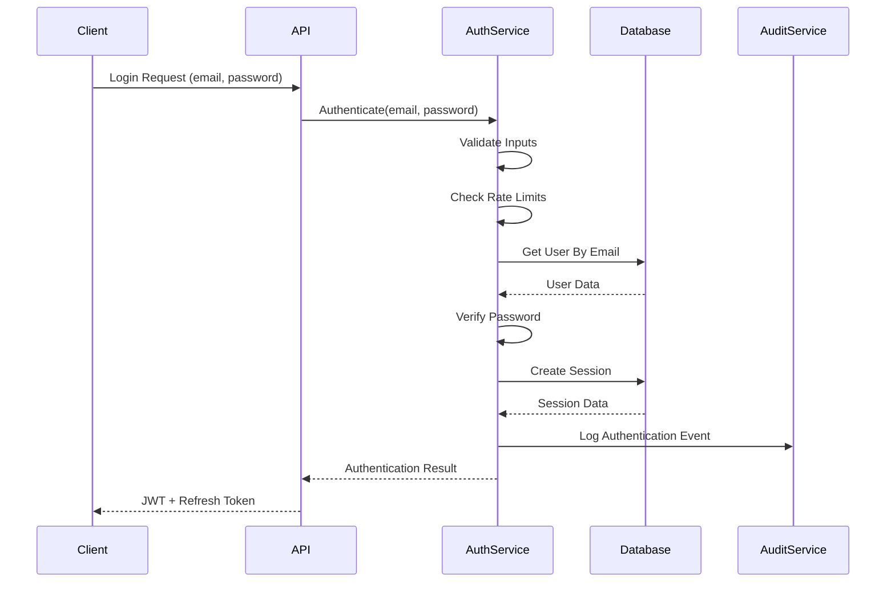

# Authentication and Authorization System

> **Version**: 2.0.0  
> **Last Updated**: 2025-05-19

This document details the authentication and authorization systems, with specific focus on implementation details, algorithms, and integration points.

## Authentication Architecture

### Authentication Flow Implementation

The authentication system implements a JWT-based approach with refresh token rotation for enhanced security:



### Authentication Implementation Code

```typescript
// Core authentication service implementation
class AuthenticationService {
  // Maximum login attempts before rate limiting
  private MAX_ATTEMPTS = 5;
  // Time window for rate limiting in seconds
  private RATE_LIMIT_WINDOW = 300; // 5 minutes
  // JWT expiration time in seconds
  private JWT_EXPIRATION = 900; // 15 minutes
  // Refresh token expiration in seconds
  private REFRESH_TOKEN_EXPIRATION = 1209600; // 14 days
  
  /**
   * Authenticate a user with email and password
   */
  async authenticateUser(email: string, password: string): Promise<AuthResult> {
    try {
      // 1. Input validation
      if (!email || !password) {
        throw new AuthError('INVALID_CREDENTIALS', 'Email and password are required');
      }
      
      // 2. Rate limiting check
      const ipAddress = this.getClientIPAddress();
      await this.enforceRateLimit(ipAddress, 'login');
      
      // 3. Get user from database
      const user = await this.getUserByEmail(email);
      
      // 4. If user not found, perform dummy password check to prevent timing attacks
      if (!user) {
        await this.comparePasswordWithDummy(password);
        throw new AuthError('INVALID_CREDENTIALS', 'Invalid email or password');
      }
      
      // 5. Check if account is locked
      if (user.status === 'locked') {
        // Log failed attempt
        await this.auditAuthEvent('login_blocked', user.id, {
          reason: 'account_locked'
        });
        
        throw new AuthError('ACCOUNT_LOCKED', 'Account is locked, please contact support');
      }
      
      // 6. Check password
      const passwordValid = await this.verifyPassword(user.passwordHash, password);
      
      // 7. Handle invalid password
      if (!passwordValid) {
        // Increment failed attempts
        await this.incrementFailedAttempts(user.id);
        
        // Check if we should lock the account
        const failedAttempts = await this.getFailedAttempts(user.id);
        if (failedAttempts >= this.MAX_ATTEMPTS) {
          await this.lockAccount(user.id, 'too_many_failed_attempts');
        }
        
        // Log failed attempt
        await this.auditAuthEvent('login_failure', user.id, {
          reason: 'invalid_password',
          attempts: failedAttempts
        });
        
        throw new AuthError('INVALID_CREDENTIALS', 'Invalid email or password');
      }
      
      // 8. Reset failed attempts on successful login
      await this.resetFailedAttempts(user.id);
      
      // 9. Create session with JWT and refresh token
      const session = await this.createSession(user);
      
      // 10. Audit successful login
      await this.auditAuthEvent('login_success', user.id, {
        sessionId: session.id
      });
      
      // 11. Return tokens
      return {
        accessToken: session.jwt,
        refreshToken: session.refreshToken,
        expiresIn: this.JWT_EXPIRATION,
        user: this.sanitizeUser(user)
      };
    } catch (error) {
      // Re-throw auth errors directly
      if (error instanceof AuthError) {
        throw error;
      }
      
      // Log unexpected errors
      console.error('Authentication error:', error);
      throw new AuthError('INTERNAL_ERROR', 'An unexpected error occurred');
    }
  }
  
  /**
   * Refresh session using a refresh token
   */
  async refreshSession(refreshToken: string): Promise<AuthResult> {
    try {
      // 1. Validate refresh token
      if (!refreshToken) {
        throw new AuthError('INVALID_TOKEN', 'Refresh token is required');
      }
      
      // 2. Find session by refresh token
      const session = await this.getSessionByRefreshToken(refreshToken);
      
      if (!session) {
        throw new AuthError('INVALID_TOKEN', 'Invalid refresh token');
      }
      
      // 3. Check if refresh token is expired
      if (this.isTokenExpired(session.refreshTokenExpiresAt)) {
        await this.invalidateSession(session.id);
        
        // Log expired token attempt
        await this.auditAuthEvent('token_expired', session.userId, {
          tokenType: 'refresh',
          sessionId: session.id
        });
        
        throw new AuthError('TOKEN_EXPIRED', 'Refresh token has expired');
      }
      
      // 4. Get user
      const user = await this.getUserById(session.userId);
      
      if (!user) {
        throw new AuthError('USER_NOT_FOUND', 'User no longer exists');
      }
      
      // 5. Check user status
      if (user.status !== 'active') {
        throw new AuthError('ACCOUNT_INACTIVE', `Account is ${user.status}`);
      }
      
      // 6. Implement refresh token rotation - invalidate the old one
      await this.invalidateRefreshToken(session.id);
      
      // 7. Create new session
      const newSession = await this.createSession(user);
      
      // 8. Audit token refresh
      await this.auditAuthEvent('token_refresh', user.id, {
        oldSessionId: session.id,
        newSessionId: newSession.id
      });
      
      // 9. Return new tokens
      return {
        accessToken: newSession.jwt,
        refreshToken: newSession.refreshToken,
        expiresIn: this.JWT_EXPIRATION,
        user: this.sanitizeUser(user)
      };
    } catch (error) {
      // Re-throw auth errors directly
      if (error instanceof AuthError) {
        throw error;
      }
      
      // Log unexpected errors
      console.error('Token refresh error:', error);
      throw new AuthError('INTERNAL_ERROR', 'An unexpected error occurred');
    }
  }
  
  /**
   * Sign out a user by invalidating their session
   */
  async signOut(refreshToken: string): Promise<void> {
    try {
      // Find session
      const session = await this.getSessionByRefreshToken(refreshToken);
      
      if (!session) {
        return; // Already logged out
      }
      
      // Invalidate session
      await this.invalidateSession(session.id);
      
      // Audit logout
      await this.auditAuthEvent('logout', session.userId, {
        sessionId: session.id
      });
    } catch (error) {
      console.error('Sign out error:', error);
      // Don't throw on sign out errors, just log them
    }
  }
  
  // Implementation of helper methods omitted for brevity
  // ...
}
```

### Token Generation and Validation

The system implements these precise algorithms for token handling:

```typescript
/**
 * JWT generation algorithm
 */
function generateJWT(userId: string, sessionId: string): string {
  // 1. Create payload
  const payload = {
    sub: userId,
    jti: sessionId,
    iat: Math.floor(Date.now() / 1000),
    exp: Math.floor(Date.now() / 1000) + JWT_EXPIRATION
  };
  
  // 2. Sign with secret
  return jwt.sign(payload, JWT_SECRET, {
    algorithm: 'HS256'
  });
}

/**
 * Refresh token generation algorithm
 */
function generateRefreshToken(): string {
  // Generate a cryptographically secure random token
  // 32 bytes = 256 bits of entropy
  return crypto.randomBytes(32).toString('hex');
}

/**
 * JWT validation algorithm
 */
function validateJWT(token: string): JWTValidationResult {
  try {
    // 1. Verify signature and decode
    const decoded = jwt.verify(token, JWT_SECRET);
    
    // 2. Extract relevant claims
    const userId = decoded.sub;
    const sessionId = decoded.jti;
    const expirationTime = decoded.exp;
    
    // 3. Additional validation checks
    const currentTime = Math.floor(Date.now() / 1000);
    
    if (expirationTime < currentTime) {
      return {
        valid: false,
        reason: 'expired'
      };
    }
    
    // 4. Return successful validation
    return {
      valid: true,
      userId,
      sessionId
    };
  } catch (error) {
    // Handle specific verification errors
    if (error instanceof jwt.JsonWebTokenError) {
      return {
        valid: false,
        reason: 'invalid'
      };
    }
    
    if (error instanceof jwt.TokenExpiredError) {
      return {
        valid: false,
        reason: 'expired'
      };
    }
    
    // Other errors
    return {
      valid: false,
      reason: 'error'
    };
  }
}
```

### Session Management Implementation

The system implements this specific approach to session management:

1. **Session Creation**:
   ```typescript
   /**
    * Create session algorithm
    */
   async function createSession(user: User): Promise<Session> {
     // 1. Generate a unique session ID
     const sessionId = uuidv4();
     
     // 2. Generate refresh token
     const refreshToken = generateRefreshToken();
     
     // 3. Generate JWT
     const jwt = generateJWT(user.id, sessionId);
     
     // 4. Calculate expiration times
     const jwtExpiresAt = new Date(Date.now() + JWT_EXPIRATION * 1000);
     const refreshTokenExpiresAt = new Date(Date.now() + REFRESH_TOKEN_EXPIRATION * 1000);
     
     // 5. Store session in database
     const session = await db.sessions.create({
       data: {
         id: sessionId,
         userId: user.id,
         refreshToken: await hashToken(refreshToken),
         jwtExpiresAt,
         refreshTokenExpiresAt,
         userAgent: getUserAgent(),
         ipAddress: getClientIPAddress(),
         lastActive: new Date()
       }
     });
     
     // 6. Return session with plaintext tokens for client
     return {
       ...session,
       jwt,
       refreshToken
     };
   }
   ```

2. **Session Validation**:
   ```typescript
   async function validateSession(token: string): Promise<SessionValidationResult> {
     // 1. Validate JWT
     const jwtValidation = validateJWT(token);
     
     if (!jwtValidation.valid) {
       return {
         valid: false,
         reason: jwtValidation.reason
       };
     }
     
     // 2. Check if session exists and is active
     const session = await db.sessions.findUnique({
       where: {
         id: jwtValidation.sessionId
       }
     });
     
     if (!session) {
       return {
         valid: false,
         reason: 'invalid_session'
       };
     }
     
     if (session.status !== 'active') {
       return {
         valid: false,
         reason: 'session_' + session.status
       };
     }
     
     // 3. Get user
     const user = await db.users.findUnique({
       where: {
         id: jwtValidation.userId
       }
     });
     
     if (!user) {
       return {
         valid: false,
         reason: 'user_not_found'
       };
     }
     
     if (user.status !== 'active') {
       return {
         valid: false,
         reason: 'user_' + user.status
       };
     }
     
     // 4. Update last active timestamp
     await db.sessions.update({
       where: {
         id: session.id
       },
       data: {
         lastActive: new Date()
       }
     });
     
     // 5. Return successful validation
     return {
       valid: true,
       session,
       user
     };
   }
   ```

3. **Session Invalidation**:
   ```typescript
   async function invalidateSession(sessionId: string, reason = 'user_logout'): Promise<void> {
     // 1. Mark session as invalidated in database
     await db.sessions.update({
       where: {
         id: sessionId
       },
       data: {
         status: 'invalidated',
         invalidatedAt: new Date(),
         invalidationReason: reason
       }
     });
     
     // 2. Audit session invalidation
     const session = await db.sessions.findUnique({
       where: { id: sessionId },
       select: { userId: true }
     });
     
     if (session) {
       await auditService.logEvent({
         type: 'authentication',
         subtype: 'session_invalidated',
         userId: session.userId,
         metadata: {
           sessionId,
           reason
         }
       });
     }
   }
   ```

### Rate Limiting Implementation

The system implements this algorithm for rate limiting to prevent abuse:

```typescript
/**
 * Rate limiting algorithm
 */
async function enforceRateLimit(
  identifier: string, 
  action: string, 
  limit = 5, 
  windowSeconds = 300
): Promise<RateLimitResult> {
  // 1. Create a unique key for this identifier and action
  const key = `rate:${action}:${identifier}`;
  
  // 2. Get current count from Redis or similar store
  const currentValue = await cache.get(key) || '0';
  const currentCount = parseInt(currentValue, 10);
  
  // 3. Check if limit exceeded
  if (currentCount >= limit) {
    // 4. Get TTL to know how long until reset
    const ttl = await cache.ttl(key);
    
    return {
      allowed: false,
      remaining: 0,
      retryAfter: ttl
    };
  }
  
  // 5. Increment count
  const newCount = currentCount + 1;
  
  // 6. If first request, set with expiry
  if (currentCount === 0) {
    await cache.set(key, newCount.toString(), windowSeconds);
  } else {
    // Just increment existing key
    await cache.incr(key);
  }
  
  // 7. Return success result
  return {
    allowed: true,
    remaining: limit - newCount,
    retryAfter: 0
  };
}
```

### Multi-Factor Authentication Implementation

The system implements a secure algorithm for MFA:

```typescript
/**
 * Generate TOTP secret algorithm
 */
function generateTOTPSecret(): TOTPSecret {
  // 1. Generate a cryptographically secure random secret
  const secret = authenticator.generateSecret();
  
  // 2. Create an authentication URL for QR code generation
  const otpauth = authenticator.keyuri(
    user.email,
    'ApplicationName',
    secret
  );
  
  // 3. Return the secret and authentication URL
  return {
    secret,
    otpauth
  };
}

/**
 * Verify TOTP token algorithm
 */
function verifyTOTPToken(secret: string, token: string): boolean {
  // Check if the token matches with a 30-second window
  return authenticator.verify({
    token,
    secret,
    window: 1 // Allow 1 period before/after for clock drift
  });
}

/**
 * Complete MFA setup algorithm
 */
async function completeMFASetup(
  userId: string, 
  secret: string, 
  token: string
): Promise<boolean> {
  // 1. Verify the token matches the secret
  const isValid = verifyTOTPToken(secret, token);
  
  if (!isValid) {
    return false;
  }
  
  // 2. Store the verified secret
  await db.users.update({
    where: { id: userId },
    data: {
      mfaSecret: await encryptMFASecret(secret),
      mfaEnabled: true
    }
  });
  
  // 3. Generate backup codes
  const backupCodes = generateBackupCodes();
  
  // 4. Store hashed backup codes
  await db.mfaBackupCodes.createMany({
    data: backupCodes.map(code => ({
      userId,
      codeHash: hashBackupCode(code),
      used: false
    }))
  });
  
  // 5. Audit MFA enablement
  await auditService.logEvent({
    type: 'authentication',
    subtype: 'mfa_enabled',
    userId
  });
  
  // 6. Return success
  return true;
}

/**
 * Verify MFA during login algorithm
 */
async function verifyMFADuringLogin(
  sessionId: string, 
  userId: string, 
  token: string
): Promise<boolean> {
  // 1. Check if it's a backup code
  if (token.length === 10) { // Backup codes are 10 chars
    return await verifyAndConsumeBackupCode(userId, token);
  }
  
  // 2. Get user's MFA secret
  const user = await db.users.findUnique({
    where: { id: userId },
    select: { mfaSecret: true }
  });
  
  if (!user?.mfaSecret) {
    return false;
  }
  
  // 3. Decrypt MFA secret
  const secret = await decryptMFASecret(user.mfaSecret);
  
  // 4. Verify the token
  const isValid = verifyTOTPToken(secret, token);
  
  // 5. Audit MFA verification
  await auditService.logEvent({
    type: 'authentication',
    subtype: isValid ? 'mfa_success' : 'mfa_failure',
    userId,
    metadata: {
      sessionId
    }
  });
  
  return isValid;
}
```

## Authorization System

### Permission Resolution Algorithm

The system implements this algorithm for resolving permissions across roles:

```typescript
/**
 * Check user permission algorithm
 */
async function checkUserPermission(
  userId: string, 
  resourceType: string, 
  action: string, 
  resourceId?: string
): Promise<boolean> {
  // 1. Cache key generation
  const cacheKey = resourceId 
    ? `perm:${userId}:${resourceType}:${resourceId}:${action}`
    : `perm:${userId}:${resourceType}:${action}`;
  
  // 2. Check cache first
  const cachedResult = await cache.get(cacheKey);
  if (cachedResult !== undefined) {
    return cachedResult === 'true';
  }
  
  // 3. Get user roles
  const userRoles = await getUserRoles(userId);
  
  // 4. SuperAdmin shortcut
  if (userRoles.includes('super_admin')) {
    await cache.set(cacheKey, 'true', 3600); // 1 hour
    return true;
  }
  
  // 5. For basic users, check default permissions
  if (userRoles.includes('user')) {
    const isDefaultPermission = BASIC_USER_DEFAULT_PERMISSIONS.some(
      p => p.resource === resourceType && p.action === action
    );
    
    if (isDefaultPermission) {
      await cache.set(cacheKey, 'true', 3600);
      return true;
    }
  }
  
  // 6. Check if any role grants this permission
  let hasPermission = false;
  
  // 7. Resource-specific permission check
  if (resourceId) {
    for (const role of userRoles) {
      // Check resource-specific permissions first
      const specificPermission = await db.rolePermissions.findFirst({
        where: {
          roleId: role,
          permission: {
            resourceType,
            action,
            resourceId
          }
        }
      });
      
      if (specificPermission) {
        hasPermission = true;
        break;
      }
      
      // Check general permissions for this resource type
      const generalPermission = await db.rolePermissions.findFirst({
        where: {
          roleId: role,
          permission: {
            resourceType,
            action,
            resourceId: null
          }
        }
      });
      
      if (generalPermission) {
        hasPermission = true;
        break;
      }
    }
  } 
  // 8. General permission check (no specific resource)
  else {
    for (const role of userRoles) {
      const permission = await db.rolePermissions.findFirst({
        where: {
          roleId: role,
          permission: {
            resourceType,
            action,
            resourceId: null
          }
        }
      });
      
      if (permission) {
        hasPermission = true;
        break;
      }
    }
  }
  
  // 9. Audit permission check
  await auditService.logEvent({
    type: 'authorization',
    subtype: 'permission_check',
    userId,
    metadata: {
      resourceType,
      resourceId,
      action,
      granted: hasPermission
    }
  });
  
  // 10. Cache result
  await cache.set(cacheKey, hasPermission ? 'true' : 'false', 3600);
  
  return hasPermission;
}
```

### Permission Enforcement Points

The system implements permission checks at these layers:

1. **API Layer**:
   ```typescript
   /**
    * Permission middleware for API routes
    */
   function requirePermission(resourceType: string, action: string) {
     return async (req: Request, res: Response, next: NextFunction) => {
       try {
         // 1. Extract user from request (added by auth middleware)
         const userId = req.user?.id;
         
         if (!userId) {
           return res.status(401).json({
             error: 'Unauthorized',
             message: 'Authentication required'
           });
         }
         
         // 2. Check permission
         const hasPermission = await checkUserPermission(userId, resourceType, action);
         
         // 3. If no permission, deny access
         if (!hasPermission) {
           return res.status(403).json({
             error: 'Forbidden',
             message: 'You do not have permission to perform this action'
           });
         }
         
         // 4. Permission granted, continue
         next();
       } catch (error) {
         next(error);
       }
     };
   }
   ```

2. **Service Layer**:
   ```typescript
   /**
    * Service-level permission check
    */
   async function enforcePermission(
     userId: string, 
     resourceType: string, 
     action: string, 
     resourceId?: string
   ): Promise<void> {
     const hasPermission = await checkUserPermission(userId, resourceType, action, resourceId);
     
     if (!hasPermission) {
       throw new PermissionError(
         `User ${userId} does not have permission to ${action} ${resourceType}` +
         (resourceId ? ` with ID ${resourceId}` : '')
       );
     }
   }
   ```

3. **Database Layer**:
   ```sql
   -- Row-Level Security Policy Example
   CREATE POLICY user_data_access ON user_data
     USING (
       -- First check: Is the user a SuperAdmin?
       (SELECT is_super_admin FROM users WHERE id = current_setting('app.current_user_id')::uuid)
       
       -- Second check: Is the user the owner of this data?
       OR (user_id = current_user_id())
       
       -- Third check: Does the user have explicit permission?
       OR EXISTS (
         SELECT 1 FROM user_roles ur
         JOIN role_permissions rp ON ur.role_id = rp.role_id
         JOIN permissions p ON rp.permission_id = p.id
         WHERE ur.user_id = current_user_id()
           AND p.resource_type = 'user_data'
           AND p.action = 'view'
       )
     );
   ```

4. **Component Layer**:
   ```tsx
   /**
    * Permission-aware component
    */
   function ProtectedComponent({ 
     resourceType, 
     action,
     resourceId,
     children,
     fallback = null
   }) {
     const { user } = useAuth();
     const [hasPermission, setHasPermission] = useState<boolean|null>(null);
     
     useEffect(() => {
       if (!user) {
         setHasPermission(false);
         return;
       }
       
       async function checkPermission() {
         try {
           const result = await permissionService.checkPermission(
             resourceType, 
             action,
             resourceId
           );
           setHasPermission(result);
         } catch (error) {
           console.error('Permission check failed:', error);
           setHasPermission(false);
         }
       }
       
       checkPermission();
     }, [user, resourceType, action, resourceId]);
     
     if (hasPermission === null) {
       return <LoadingSpinner />;
     }
     
     return hasPermission ? children : fallback;
   }
   ```

### Temporary Permission Elevation

The system implements a secure algorithm for temporary permission elevation:

```typescript
/**
 * Elevate permissions temporarily algorithm
 */
async function elevatePermissions(
  userId: string,
  requestedPermissions: Array<{resourceType: string, action: string}>,
  reason: string,
  durationMinutes: number = 30
): Promise<ElevationResult> {
  try {
    // 1. Validate permissions being requested
    const validPermissions = await validateElevationPermissions(userId, requestedPermissions);
    
    if (validPermissions.length === 0) {
      throw new Error('None of the requested permissions can be granted');
    }
    
    // 2. Create elevation record
    const elevationId = uuidv4();
    const expiresAt = new Date(Date.now() + durationMinutes * 60 * 1000);
    
    await db.permissionElevations.create({
      id: elevationId,
      userId,
      reason,
      expiresAt,
      createdAt: new Date()
    });
    
    // 3. Store elevated permissions
    await db.elevatedPermissions.createMany({
      data: validPermissions.map(p => ({
        elevationId,
        resourceType: p.resourceType,
        action: p.action
      }))
    });
    
    // 4. Audit elevation
    await auditService.logEvent({
      type: 'authorization',
      subtype: 'permission_elevation',
      userId,
      metadata: {
        elevationId,
        reason,
        permissions: validPermissions,
        expiresAt
      }
    });
    
    // 5. Schedule expiration
    scheduleElevationExpiration(elevationId, expiresAt);
    
    // 6. Return success result
    return {
      success: true,
      elevationId,
      grantedPermissions: validPermissions,
      expiresAt
    };
  } catch (error) {
    // 7. Log failure
    console.error('Permission elevation failed:', error);
    
    await auditService.logEvent({
      type: 'authorization',
      subtype: 'permission_elevation_failed',
      userId,
      metadata: {
        reason,
        requestedPermissions,
        error: error.message
      }
    });
    
    // 8. Return failure result
    return {
      success: false,
      error: error.message
    };
  }
}

/**
 * Check elevated permission algorithm
 */
async function checkElevatedPermission(
  userId: string,
  resourceType: string,
  action: string
): Promise<boolean> {
  // 1. Check for active elevation grants
  const elevatedPermission = await db.elevatedPermissions.findFirst({
    where: {
      elevation: {
        userId,
        expiresAt: {
          gt: new Date() // Not expired
        }
      },
      resourceType,
      action
    },
    include: {
      elevation: true
    }
  });
  
  if (!elevatedPermission) {
    return false;
  }
  
  // 2. Audit elevated permission usage
  await auditService.logEvent({
    type: 'authorization',
    subtype: 'elevated_permission_used',
    userId,
    metadata: {
      elevationId: elevatedPermission.elevationId,
      resourceType,
      action,
      reason: elevatedPermission.elevation.reason
    }
  });
  
  return true;
}
```

## Role Management Implementation

### Role Creation Algorithm

```typescript
/**
 * Create role algorithm
 */
async function createRole(
  creatorUserId: string,
  name: string,
  description: string,
  initialPermissions: Array<{resourceType: string, action: string}>
): Promise<Role> {
  // 1. Verify creator has permission to create roles
  await enforcePermission(creatorUserId, 'roles', 'create');
  
  // 2. Check if role name already exists
  const existingRole = await db.roles.findUnique({
    where: {
      name
    }
  });
  
  if (existingRole) {
    throw new Error(`Role "${name}" already exists`);
  }
  
  // 3. Create the role
  const role = await db.roles.create({
    data: {
      name,
      description,
      createdBy: creatorUserId,
      isSystem: false
    }
  });
  
  // 4. Create initial permissions
  if (initialPermissions.length > 0) {
    // 4.1. Filter out permissions the creator doesn't have
    const creatorPermissions = await getAllUserPermissions(creatorUserId);
    const filteredPermissions = initialPermissions.filter(p => 
      creatorPermissions.some(cp => 
        cp.resourceType === p.resourceType && cp.action === p.action
      )
    );
    
    // 4.2. Create permissions
    if (filteredPermissions.length > 0) {
      await addPermissionsToRole(creatorUserId, role.id, filteredPermissions);
    }
    
    // 4.3. Log if some permissions weren't added
    if (filteredPermissions.length < initialPermissions.length) {
      console.warn(`Some permissions were not added to role "${name}" because the creator doesn't have them`);
    }
  }
  
  // 5. Audit role creation
  await auditService.logEvent({
    type: 'authorization',
    subtype: 'role_created',
    userId: creatorUserId,
    metadata: {
      roleId: role.id,
      roleName: name,
      initialPermissions: initialPermissions.length
    }
  });
  
  return role;
}
```

### Role Permission Management Algorithm

```typescript
/**
 * Add permissions to role algorithm
 */
async function addPermissionsToRole(
  userId: string,
  roleId: string,
  permissions: Array<{resourceType: string, action: string}>
): Promise<void> {
  // 1. Verify user can update roles
  await enforcePermission(userId, 'roles', 'update');
  
  // 2. Get role
  const role = await db.roles.findUnique({
    where: {
      id: roleId
    }
  });
  
  if (!role) {
    throw new Error('Role not found');
  }
  
  // 3. Prevent modification of system roles by non-superadmins
  if (role.isSystem) {
    const isSuperAdmin = await checkUserRole(userId, 'super_admin');
    if (!isSuperAdmin) {
      throw new Error('Only SuperAdmins can modify system roles');
    }
  }
  
  // 4. Verify user has all permissions they're trying to grant
  const userPermissions = await getAllUserPermissions(userId);
  
  for (const permission of permissions) {
    const hasPermission = userPermissions.some(p => 
      p.resourceType === permission.resourceType && 
      p.action === permission.action
    );
    
    if (!hasPermission) {
      throw new Error(
        `Cannot grant permission ${permission.action} on ${permission.resourceType} ` +
        `because you don't have this permission yourself`
      );
    }
  }
  
  // 5. Add permissions
  const permissionRecords = [];
  
  for (const permission of permissions) {
    // 5.1. Get or create permission record
    let permissionRecord = await db.permissions.findFirst({
      where: {
        resourceType: permission.resourceType,
        action: permission.action
      }
    });
    
    if (!permissionRecord) {
      permissionRecord = await db.permissions.create({
        data: {
          resourceType: permission.resourceType,
          action: permission.action
        }
      });
    }
    
    // 5.2. Check if permission is already assigned
    const existingRolePermission = await db.rolePermissions.findFirst({
      where: {
        roleId,
        permissionId: permissionRecord.id
      }
    });
    
    if (!existingRolePermission) {
      // 5.3. Add permission to role
      permissionRecords.push({
        roleId,
        permissionId: permissionRecord.id
      });
    }
  }
  
  if (permissionRecords.length > 0) {
    await db.rolePermissions.createMany({
      data: permissionRecords
    });
  }
  
  // 6. Audit permission changes
  await auditService.logEvent({
    type: 'authorization',
    subtype: 'role_permissions_added',
    userId,
    metadata: {
      roleId,
      roleName: role.name,
      permissions: permissions.map(p => `${p.resourceType}.${p.action}`)
    }
  });
  
  // 7. Invalidate permission caches
  await invalidateRolePermissionCache(roleId);
}

/**
 * Remove permissions from role algorithm
 */
async function removePermissionsFromRole(
  userId: string,
  roleId: string,
  permissions: Array<{resourceType: string, action: string}>
): Promise<void> {
  // 1. Verify user can update roles
  await enforcePermission(userId, 'roles', 'update');
  
  // 2. Get role
  const role = await db.roles.findUnique({
    where: {
      id: roleId
    }
  });
  
  if (!role) {
    throw new Error('Role not found');
  }
  
  // 3. Prevent modification of protected permissions
  if (role.name === 'super_admin') {
    throw new Error('SuperAdmin permissions cannot be modified');
  }
  
  if (role.name === 'user') {
    // Check if trying to remove default user permissions
    const isSuperAdmin = await checkUserRole(userId, 'super_admin');
    
    if (!isSuperAdmin) {
      throw new Error('Only SuperAdmins can modify default user permissions');
    }
    
    // Check for protected basic user permissions
    for (const permission of permissions) {
      const isDefaultPermission = BASIC_USER_DEFAULT_PERMISSIONS.some(
        p => p.resource === permission.resourceType && p.action === permission.action
      );
      
      if (isDefaultPermission) {
        throw new Error(`Cannot remove default permission ${permission.action} on ${permission.resourceType} from basic user role`);
      }
    }
  }
  
  // 4. Remove permissions
  for (const permission of permissions) {
    // 4.1. Get permission record
    const permissionRecord = await db.permissions.findFirst({
      where: {
        resourceType: permission.resourceType,
        action: permission.action
      }
    });
    
    if (permissionRecord) {
      // 4.2. Remove permission from role
      await db.rolePermissions.deleteMany({
        where: {
          roleId,
          permissionId: permissionRecord.id
        }
      });
    }
  }
  
  // 5. Audit permission changes
  await auditService.logEvent({
    type: 'authorization',
    subtype: 'role_permissions_removed',
    userId,
    metadata: {
      roleId,
      roleName: role.name,
      permissions: permissions.map(p => `${p.resourceType}.${p.action}`)
    }
  });
  
  // 6. Invalidate permission caches
  await invalidateRolePermissionCache(roleId);
}
```

### Integration Points

### Authentication and Audit Integration

The system implements these technical integration points between the authentication system and audit logging:

```typescript
/**
 * Authentication event audit integration
 */
async function auditAuthEvent(
  subtype: string,
  userId: string | null,
  metadata: Record<string, any> = {}
): Promise<void> {
  // 1. Map auth event subtypes to standardized audit schema
  const eventType = 'authentication';
  
  // 2. Construct the audit event
  const auditEvent = {
    type: eventType,
    subtype,
    timestamp: new Date(),
    userId,
    ipAddress: getClientIPAddress(),
    userAgent: getUserAgent(),
    metadata
  };
  
  // 3. Record audit event
  await auditService.logEvent(auditEvent);
  
  // 4. For high-importance events, trigger notifications
  const criticalEvents = ['login_blocked', 'password_reset', 'mfa_disabled'];
  
  if (criticalEvents.includes(subtype) && userId) {
    await notificationService.securityAlert(userId, subtype, metadata);
  }
}
```

### Authorization and Audit Integration

The system implements these technical integration points between the authorization system and audit logging:

```typescript
/**
 * Authorization event audit integration
 */
async function auditPermissionEvent(
  subtype: string,
  userId: string,
  targetId: string | null,
  metadata: Record<string, any> = {}
): Promise<void> {
  // 1. Map permission event subtypes to standardized audit schema
  const eventType = 'authorization';
  
  // 2. Construct the audit event
  const auditEvent = {
    type: eventType,
    subtype,
    timestamp: new Date(),
    userId,
    targetId,
    ipAddress: getClientIPAddress(),
    userAgent: getUserAgent(),
    metadata
  };
  
  // 3. Record audit event
  await auditService.logEvent(auditEvent);
  
  // 4. For sensitive permission operations, trigger notifications
  const sensitiveEvents = ['role_created', 'role_deleted', 'permission_elevation'];
  
  if (sensitiveEvents.includes(subtype)) {
    await notificationService.permissionChangeAlert(userId, targetId, subtype, metadata);
  }
}
```

## Related Documentation

For more detailed information, refer to:

- **[../RBAC_SYSTEM.md](../RBAC_SYSTEM.md)**: Detailed RBAC specification
- **[../audit/SECURITY_INTEGRATION.md](../audit/SECURITY_INTEGRATION.md)**: Security event audit integration
- **[AUTH_SYSTEM.md](AUTH_SYSTEM.md)**: Core authentication system
- **[SECURITY_MONITORING.md](SECURITY_MONITORING.md)**: How auth events are monitored
- **[SECURE_DEVELOPMENT.md](SECURE_DEVELOPMENT.md)**: Security development practices
- **[../implementation/TECHNICAL_DECISIONS.md](../implementation/TECHNICAL_DECISIONS.md)**: Technical decisions for auth architecture
- **[MULTI_TENANT_ROLES.md](MULTI_TENANT_ROLES.md)**: Entity-specific role management

## Version History

- **2.0.0**: Added detailed implementation algorithms for authentication flow, permission resolution, role management
- **1.1.0**: Added integration points for audit logging and enhanced token security details
- **1.0.2**: Updated references to RBAC system to reflect direct permission assignment model
- **1.0.1**: Added security monitoring integration points
- **1.0.0**: Initial document structure
