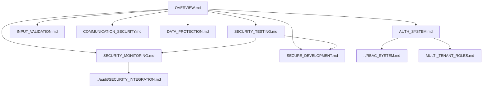

# Security Implementation Overview

> **Version**: 2.1.0  
> **Last Updated**: 2025-05-19

## Core Principles

This document outlines the security standards and architectural decisions for our application. These guidelines ensure that all parts of the application are developed with security as a primary concern.

The security architecture is based on the following core principles:

1. **Defense in Depth**: Multiple layers of security controls
2. **Least Privilege**: Minimum necessary access rights
3. **Secure by Default**: Security enabled by default
4. **Privacy by Design**: Privacy considerations from the start

## Architectural Framework

The security architecture covers these key areas:

1. **[INPUT_VALIDATION.md](INPUT_VALIDATION.md)**: Strategy for protecting against injection attacks
2. **[AUTH_SYSTEM.md](AUTH_SYSTEM.md)**: Approach to securing user identity and access
3. **[COMMUNICATION_SECURITY.md](COMMUNICATION_SECURITY.md)**: Architecture for protecting data in transit
4. **[DATA_PROTECTION.md](DATA_PROTECTION.md)**: Framework for securing sensitive information
5. **[SECURITY_TESTING.md](SECURITY_TESTING.md)**: Methodology for verifying security controls
6. **[SECURITY_MONITORING.md](SECURITY_MONITORING.md)**: Strategy for detecting and responding to threats

## Security Architecture Map



## Security Responsibility Matrix

| Security Area | Developers | Security Team | SuperAdmin | User |
|---------------|------------|--------------|------------|------|
| Input Validation | Implement | Review & Audit | - | Report Issues |
| Authentication | Implement | Review & Test | Configure MFA Policy | Enable MFA |
| Authorization | Implement | Audit | Manage Roles | - |
| Data Protection | Implement | Review | Configure Policies | Manage Personal Data |
| Audit Logging | Implement | Monitor | Review Logs | - |
| Theme Security | Implement | Review | Set Global Themes | Set Personal Themes |
| Mobile Security | Implement | Test & Verify | Set Policies | Follow Guidelines |

## Security Architecture Decisions

1. **Authentication Mechanism**: JWT-based with refresh token rotation
   - See [AUTH_SYSTEM.md](AUTH_SYSTEM.md) for detailed implementation
   - Integration with [../audit/SECURITY_INTEGRATION.md](../audit/SECURITY_INTEGRATION.md) for authentication events

2. **Authorization Framework**: Direct permission assignment to roles (no hierarchy)
   - Detailed in [../RBAC_SYSTEM.md](../RBAC_SYSTEM.md)
   - Entity-specific implementation in [MULTI_TENANT_ROLES.md](MULTI_TENANT_ROLES.md)
   - Permission enforcement at all application layers

3. **Data Encryption Strategy**: At-rest and in-transit encryption
   - Technical implementation in [DATA_PROTECTION.md](DATA_PROTECTION.md)
   - Integration with [COMMUNICATION_SECURITY.md](COMMUNICATION_SECURITY.md) for transit protection

4. **Session Management**: Secure, time-limited sessions with activity monitoring
   - Session security in [AUTH_SYSTEM.md](AUTH_SYSTEM.md)
   - Monitoring architecture in [SECURITY_MONITORING.md](SECURITY_MONITORING.md)

5. **Input Validation**: Schema-based validation with Zod
   - Detailed approach in [INPUT_VALIDATION.md](INPUT_VALIDATION.md)
   - Integration with [SECURE_DEVELOPMENT.md](SECURE_DEVELOPMENT.md)

6. **Secure Communication**: TLS 1.3+ with strong cipher suites
   - Protocol details in [COMMUNICATION_SECURITY.md](COMMUNICATION_SECURITY.md)
   - Header security implementation guidelines

7. **Mobile Security**: Platform-specific security considerations
   - Mobile-specific guidelines in [MOBILE_SECURITY.md](MOBILE_SECURITY.md)
   - Integration with core security architecture

## Technical Implementation Details

### Authentication Implementation Algorithm

The JWT-based authentication system implements this precise algorithm:

```typescript
// Authentication flow implementation
function authenticateUser(email: string, password: string): Promise<Session> {
  return new Promise(async (resolve, reject) => {
    try {
      // 1. Validate inputs with Zod schema
      const authSchema = z.object({
        email: z.string().email(),
        password: z.string().min(8)
      });
      
      const validationResult = authSchema.safeParse({ email, password });
      if (!validationResult.success) {
        throw new Error('Invalid credentials format');
      }
      
      // 2. Rate limiting check
      const ipAddress = getClientIPAddress();
      const rateLimitResult = await checkRateLimit(ipAddress, 'login');
      if (!rateLimitResult.allowed) {
        throw new Error(`Rate limit exceeded. Try again in ${rateLimitResult.retryAfter} seconds`);
      }
      
      // 3. Password verification
      const user = await getUserByEmail(email);
      if (!user) {
        // Use constant-time comparison even for non-existent users to prevent timing attacks
        await comparePassword('dummy-password-hash', password);
        throw new Error('Invalid email or password');
      }
      
      const passwordValid = await comparePassword(user.passwordHash, password);
      if (!passwordValid) {
        // 4. Audit failed login attempt
        await auditSecurityEvent({
          type: 'authentication',
          subtype: 'login_failure',
          userId: user.id,
          metadata: { reason: 'invalid_password' }
        });
        throw new Error('Invalid email or password');
      }
      
      // 5. Check account status
      if (user.status !== 'active') {
        await auditSecurityEvent({
          type: 'authentication',
          subtype: 'login_blocked',
          userId: user.id,
          metadata: { reason: user.status }
        });
        throw new Error(`Account is ${user.status}`);
      }
      
      // 6. Generate JWT and refresh token
      const session = await createSession(user);
      
      // 7. Audit successful login
      await auditSecurityEvent({
        type: 'authentication',
        subtype: 'login_success',
        userId: user.id,
        sessionId: session.id
      });
      
      // 8. Return session
      resolve(session);
    } catch (error) {
      // 9. Handle errors consistently
      reject(error);
    }
  });
}

// Refresh token implementation
function refreshUserSession(refreshToken: string): Promise<Session> {
  return new Promise(async (resolve, reject) => {
    try {
      // 1. Validate refresh token format
      if (!refreshToken || typeof refreshToken !== 'string') {
        throw new Error('Invalid refresh token format');
      }
      
      // 2. Verify token in database
      const existingSession = await getSessionByRefreshToken(refreshToken);
      if (!existingSession) {
        throw new Error('Invalid refresh token');
      }
      
      // 3. Check token expiration
      if (new Date(existingSession.refreshTokenExpiresAt) < new Date()) {
        await invalidateSession(existingSession.id);
        throw new Error('Refresh token expired');
      }
      
      // 4. Check if session was invalidated
      if (existingSession.status !== 'active') {
        throw new Error('Session has been invalidated');
      }
      
      // 5. Generate new tokens with rotation
      const user = await getUserById(existingSession.userId);
      if (!user) {
        throw new Error('User no longer exists');
      }
      
      // 6. Invalidate old refresh token
      await invalidateRefreshToken(refreshToken);
      
      // 7. Create new session
      const newSession = await createSession(user);
      
      // 8. Audit token refresh
      await auditSecurityEvent({
        type: 'authentication',
        subtype: 'token_refresh',
        userId: user.id,
        sessionId: newSession.id,
        metadata: { previousSessionId: existingSession.id }
      });
      
      // 9. Return new session
      resolve(newSession);
    } catch (error) {
      reject(error);
    }
  });
}
```

### Permission Enforcement Implementation

The system implements this algorithm for permission checks across all layers:

```typescript
// Permission check implementation
async function checkUserPermission(userId: string, resource: string, action: string): Promise<boolean> {
  // 1. Check cache first for performance
  const cacheKey = `perm:${userId}:${resource}:${action}`;
  const cachedResult = await cache.get(cacheKey);
  if (cachedResult !== undefined) {
    return cachedResult === 'true';
  }
  
  // 2. Get user roles
  const userRoles = await getUserRoles(userId);
  
  // 3. SuperAdmin short-circuit
  if (userRoles.includes('super_admin')) {
    await cache.set(cacheKey, 'true', 3600); // Cache for 1 hour
    return true;
  }
  
  // 4. Basic user default permission check
  if (userRoles.includes('user')) {
    const isDefaultPermission = BASIC_USER_DEFAULT_PERMISSIONS.some(
      p => p.resource === resource && p.action === action
    );
    
    if (isDefaultPermission) {
      await cache.set(cacheKey, 'true', 3600);
      return true;
    }
  }
  
  // 5. Check role-based permissions with direct assignment model
  let hasPermission = false;
  
  for (const role of userRoles) {
    const rolePermissions = await getRolePermissions(role);
    if (rolePermissions.some(p => p.resource === resource && p.action === action)) {
      hasPermission = true;
      break;
    }
  }
  
  // 6. Audit permission check
  await auditSecurityEvent({
    type: 'authorization',
    subtype: 'permission_check',
    userId: userId,
    metadata: {
      resource,
      action,
      granted: hasPermission
    }
  });
  
  // 7. Cache result
  await cache.set(cacheKey, hasPermission ? 'true' : 'false', 3600);
  
  return hasPermission;
}
```

### Input Validation Implementation

The system implements a multi-layer validation approach:

```typescript
// Input validation implementation
function validateAndSanitizeInput<T>(
  input: unknown, 
  schema: z.ZodType<T>,
  options: {
    sanitize?: boolean;
    transformers?: Array<(input: T) => T>;
  } = {}
): Result<T> {
  try {
    // 1. Basic schema validation
    const parseResult = schema.safeParse(input);
    
    if (!parseResult.success) {
      return {
        success: false,
        error: parseResult.error.format(),
        errorMessage: formatZodError(parseResult.error)
      };
    }
    
    let data = parseResult.data;
    
    // 2. Apply custom transformers if provided
    if (options.transformers) {
      for (const transformer of options.transformers) {
        data = transformer(data);
      }
    }
    
    // 3. Apply sanitization if requested
    if (options.sanitize) {
      data = sanitizeData(data);
    }
    
    // 4. Return validated and transformed data
    return {
      success: true,
      data
    };
  } catch (error) {
    // 5. Handle unexpected errors
    return {
      success: false,
      error,
      errorMessage: error instanceof Error ? error.message : 'Unknown validation error'
    };
  }
}

// Sanitization implementation
function sanitizeData<T>(data: T): T {
  if (typeof data === 'string') {
    // Apply HTML sanitization for strings
    return sanitizeHtml(data, SANITIZE_OPTIONS) as unknown as T;
  } else if (Array.isArray(data)) {
    // Recursively sanitize arrays
    return data.map(item => sanitizeData(item)) as unknown as T;
  } else if (data !== null && typeof data === 'object') {
    // Recursively sanitize objects
    const result: Record<string, any> = {};
    for (const [key, value] of Object.entries(data as Record<string, any>)) {
      result[key] = sanitizeData(value);
    }
    return result as T;
  }
  
  // Return primitives unchanged
  return data;
}
```

## Security Event Logging

Security events are systematically captured through the audit logging framework:

1. **Event Categories**: Authentication, authorization, configuration, data access
   - Full categorization in [SECURITY_MONITORING.md](SECURITY_MONITORING.md)
   - Mapping to audit schema in [../audit/DATABASE_STRUCTURE.md](../audit/DATABASE_STRUCTURE.md)

2. **Event Context**: Each security event includes standardized context information
   - Context format defined in [../audit/SECURITY_INTEGRATION.md](../audit/SECURITY_INTEGRATION.md)
   - Security-specific context attributes

3. **Integration**: Security events feed directly into the audit logging system
   - Technical integration detailed in [../audit/SECURITY_INTEGRATION.md](../audit/SECURITY_INTEGRATION.md)
   - Event processing flows in [../audit/LOGGING_SERVICE.md](../audit/LOGGING_SERVICE.md)
   - Security control verification via events

4. **Performance Considerations**: Optimized event capture with minimal system impact
   - Performance architecture in [../audit/PERFORMANCE_STRATEGIES.md](../audit/PERFORMANCE_STRATEGIES.md)
   - Batched security event processing
   - Priority handling for critical security events

## Implementation Roadmap

The security features follow the project's overall development roadmap:

1. **Phase 1: Foundation**
   - Core authentication mechanisms
   - Basic RBAC implementation
   - Input validation framework
   - Security event logging infrastructure

2. **Phase 2: Core Functionality**
   - Advanced authorization controls
   - Multi-factor authentication
   - Enhanced security monitoring
   - Security dashboard implementation

3. **Phase 3: Feature Development**
   - Multi-tenant security isolation
   - API security enhancements
   - Mobile security features
   - Theme security framework

4. **Phase 4: Polish and Compliance**
   - Security performance optimization
   - Compliance reporting
   - Advanced threat monitoring
   - Security documentation and training

For implementation timeline details, see [../DEVELOPMENT_ROADMAP.md](../DEVELOPMENT_ROADMAP.md).

## Related Documentation

For more detailed information about specific security aspects, please refer to the other documents in this directory and related sections:

- **[../RBAC_SYSTEM.md](../RBAC_SYSTEM.md)**: Role-based access control with direct permission assignment
- **[../audit/README.md](../audit/README.md)**: Audit logging framework and its components
  - **[../audit/SECURITY_INTEGRATION.md](../audit/SECURITY_INTEGRATION.md)**: Integration with security events
  - **[../audit/DATABASE_STRUCTURE.md](../audit/DATABASE_STRUCTURE.md)**: Audit data storage model
- **[../DOCUMENTATION_MAP.md](../DOCUMENTATION_MAP.md)**: Visual guide to documentation relationships
- **[../CORE_ARCHITECTURE.md](../CORE_ARCHITECTURE.md)**: How security fits into overall system
- **[../GLOSSARY.md](../GLOSSARY.md)**: Standardized terminology for security concepts

## Version History

- **2.1.0**: Standardized all document references with consistent relative paths and file extensions
- **2.0.0**: Added detailed technical implementation algorithms for authentication, permissions, and input validation
- **1.1.0**: Added security architecture map, enhanced cross-references, and implementation roadmap
- **1.0.3**: Added security event logging section and standardized terminology
- **1.0.2**: Updated authorization framework description to consistently reflect direct permission assignment model
- **1.0.1**: Initial document detailing core security principles and architecture
