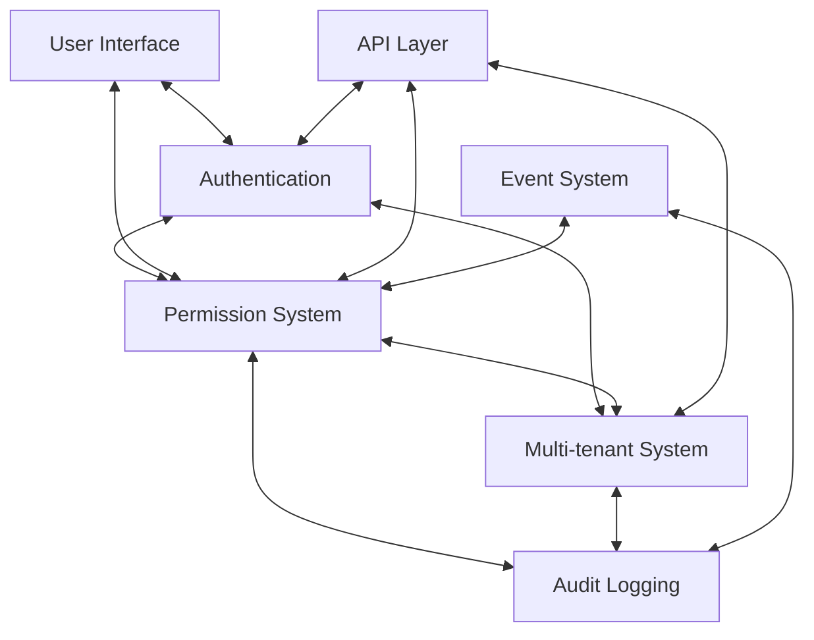

# Component Integration Testing Map

> **Version**: 1.0.0  
> **Last Updated**: 2025-05-23

## Overview

This document maps the integration points between major system components and specifies the integration tests needed to validate these connections.

## Core Integration Points



## Integration Test Matrix

| Primary Component | Secondary Component | Integration Tests Required |
|-------------------|---------------------|----------------------------|
| Authentication    | RBAC                | - Login permission resolution<br>- Session permission context<br>- Auth event permission triggers |
| Authentication    | Multi-tenant        | - Tenant context during auth<br>- Cross-tenant auth boundaries<br>- Default tenant selection |
| RBAC              | Multi-tenant        | - Tenant-specific permissions<br>- Cross-tenant permission isolation<br>- Role inheritance across tenants |
| RBAC              | Audit               | - Permission change audit events<br>- Permission check logging<br>- Audit event permissions |
| Multi-tenant      | Audit               | - Tenant-specific audit logs<br>- Cross-tenant audit boundaries<br>- Tenant change auditing |
| UI Layer          | Authentication      | - Auth flow in UI<br>- Session management in UI<br>- Auth error handling |
| UI Layer          | RBAC                | - Component permission guards<br>- Dynamic UI based on permissions<br>- Permission loading states |
| API Layer         | Authentication      | - API auth validation<br>- Token verification<br>- Auth header processing |
| API Layer         | RBAC                | - Endpoint permission checks<br>- Resource-specific permissions<br>- Permission error responses |
| API Layer         | Multi-tenant        | - Tenant header processing<br>- Cross-tenant API protection<br>- Tenant context in responses |
| Event System      | Audit               | - Event to audit pipeline<br>- Audit event batching<br>- Event correlation in audit |
| Event System      | RBAC                | - Permission-based event filtering<br>- Event-triggered permission updates<br>- Event system permissions |

## Tier 1 Integration Tests (Essential)

Implement these integration tests first as part of the Tier 1 Quick Start approach:

1. **Basic Auth-RBAC Integration**: Verify login sets correct permissions
2. **Simple Tenant Context**: Confirm auth establishes tenant context
3. **UI Permission Guards**: Test that UI components respect permissions
4. **API Auth Protection**: Validate API endpoints check authentication
5. **Basic Audit Logging**: Verify critical actions create audit records

## Tier 2 Integration Tests (Standard)

Add these integration tests as part of the Tier 2 Standard implementation:

1. **Multi-tenant Permission Resolution**: Test cross-tenant permission boundaries
2. **Role Hierarchy with Audit**: Verify role changes are properly logged
3. **Dynamic UI Permission Updates**: Test UI updates when permissions change
4. **Tenant-specific API Responses**: Validate tenant context affects API returns
5. **Event-driven Permission Updates**: Test permission changes via events
6. **Session Invalidation Flow**: Verify session invalidation across subsystems

## Tier 3 Integration Tests (Advanced)

Implement these advanced integration tests for complex scenarios:

1. **Concurrent Multi-tenant Operations**: Test simultaneous operations across tenants
2. **Permission Cache Invalidation**: Verify permission changes propagate correctly
3. **Cross-system Security Boundaries**: Test security across component boundaries
4. **Distributed Event Processing**: Validate event handling across components
5. **Performance Under Load**: Test integration points under high concurrency

## Integration Test Implementation Strategy

### 1. Component Mocking Approach

Determine which components to mock for each integration test:

```typescript
// Example: Testing RBAC with mocked Auth but real Audit
describe('RBAC-Audit Integration', () => {
  // Mock auth service
  jest.mock('../services/authService', () => ({
    verifySession: jest.fn().mockResolvedValue({
      userId: 'test-user',
      tenantId: 'test-tenant'
    })
  }));
  
  // Use real RBAC and Audit services
  const rbacService = new RBACService();
  const auditService = new AuditService();
  
  test('permission changes should be audited', async () => {
    // Test implementation
  });
});
```

### 2. Integration Test Fixtures

Create standardized fixtures for integration testing:

```typescript
// Example: Standard integration test fixtures
export const integrationFixtures = {
  users: {
    admin: {
      id: '00000000-0000-0000-0000-000000000001',
      email: 'admin@example.com',
      roles: ['super-admin']
    },
    regular: {
      id: '00000000-0000-0000-0000-000000000002',
      email: 'user@example.com',
      roles: ['basic-user']
    }
  },
  tenants: {
    primary: {
      id: '00000000-0000-0000-0000-000000000010',
      name: 'Primary Tenant'
    },
    secondary: {
      id: '00000000-0000-0000-0000-000000000011',
      name: 'Secondary Tenant'
    }
  },
  permissions: {
    view: 'documents.view',
    create: 'documents.create',
    manage: 'users.manage'
  }
};
```

### 3. Integration Test Database

Use a dedicated database approach for integration tests:

```typescript
// Example: Setup database for integration tests
export async function setupIntegrationTestDatabase() {
  // Create test schema
  await db.query('CREATE SCHEMA IF NOT EXISTS integration_test');
  
  // Run migrations on test schema
  await db.migrate({ schema: 'integration_test' });
  
  // Seed with standard test data
  await seedIntegrationTestData();
  
  // Return test database connection
  return db.withSchema('integration_test');
}

export async function cleanupIntegrationTestDatabase() {
  // Drop test schema to clean up
  await db.query('DROP SCHEMA IF EXISTS integration_test CASCADE');
}
```

## Related Documentation

- **[INTEGRATION_TESTING.md](INTEGRATION_TESTING.md)**: Detailed integration testing strategy
- **[../rbac/TESTING_STRATEGY.md](../rbac/TESTING_STRATEGY.md)**: RBAC-specific testing approach
- **[../TEST_FRAMEWORK.md](../TEST_FRAMEWORK.md)**: Overall testing framework
- **[../PERFORMANCE_STANDARDS.md](../PERFORMANCE_STANDARDS.md)**: Performance benchmarks

## Version History

- **1.0.0**: Initial component integration testing map (2025-05-23)
